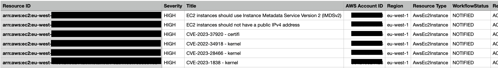
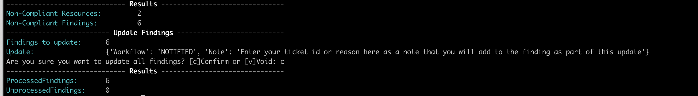
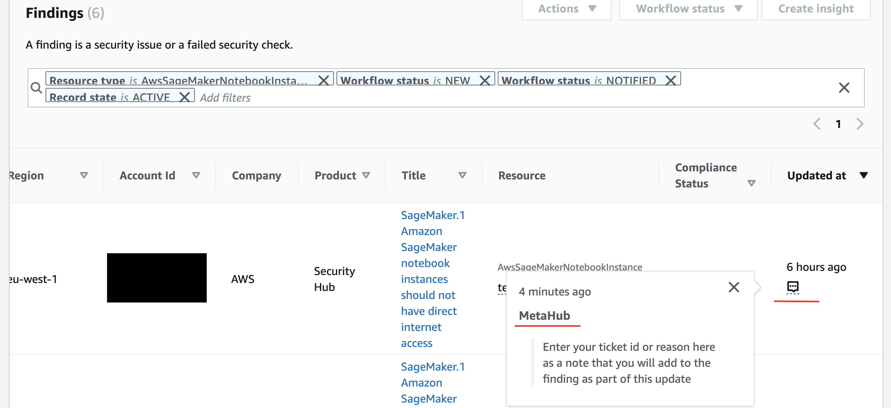
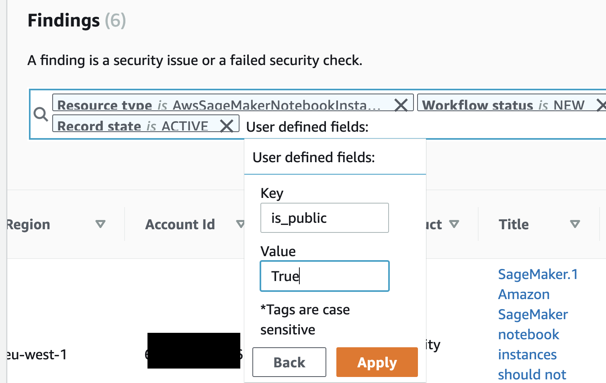

# MetaHub

<p align="center">
  
</p>

<p align="center">
  <b>MetaHub</b> is the command line utility for AWS Security Hub.
</p>

# Table of Contents

- [Description](#description)
- [Features](#features)
- [Examples](#investigations-examples)
- [Requirements](#requirements)
- [AWS Authentication](#aws-authentication)
- [Configuring Security Hub](#configuring-security-hub)
- [Usage](#usage)
- [Outputs](#Outputs)
- [Write File](#write-file)
- [Findings Aggregation](#findings-aggregation)
- [MetaChecks](#MetaChecks-1)
- [MetaTags](#MetaTags-1)
- [Filtering](#Filtering)
- [Updating Workflow Status](#updating-workflow-status)
- [Enriching Findings](#enriching-findings-1)

# Description

**MetaHub** is a command line utility for [AWS Security Hub](https://aws.amazon.com/security-hub). Using **MetaHub**, you can perform your investigations on top no matter what amount of product sources, standards, checks, or findings you have for identifying real and false positives, grouping related findings, and enriching them with data about your context.

**MetaHub** provides you with a framework to do this investigation with the help of **MetaChecks** and **MetaTags** (**your** context). **MetaChecks** and **MetaTags** are executed directly on the affected resource on the affected account, letting you fetch the information you need from the resources to then filter and generate enriched outputs or alerts.

<p align="center">
  
</p>

**MetaHub** aggregates by affected resources the information to focus on fixing the real problem, not the findings themselves.

If you are investigating a finding for a Security Group with a port open, you can use MetaHub to investigate and automate the following:

- If there are other findings for this resource
- If the security group is attached to a Network Interface (`is_attached_to_network_interfaces`)
- If the attached resource is public (`is_attached_to_public_ips`)
- If the environment is Production (MetaTags)
- If the port is answering

# Features

**MetaHub** introduces different **ways of listing AWS Security Hub findings** for investigation, suppression, updating, and integrating with other tools or alerting systems. MetaHub focuses on avoiding **Shadowing** and **Duplication** by organizing the findings together when they are related to the same resource. See [Findings Aggregation](#findings-aggregation)

**MetaHub** queries the affected resources in the affected account directly to add extra information from your context using **MetaChecks** (`--meta-checks`) and **MetaTags** (`--meta-tags`). 

You can define your own **MetaChecks** as yes/no questions using python (is public? is encrypted? is production? is accessed from development?).

**MetaTags** let you enrich your findings with the tags that are associated with the resource by using [AWS Resource Groups Tagging API](https://docs.aws.amazon.com/resourcegroupstagging/latest/APIReference/overview.html). 

You can create a filter on top of these outpus to automate the detection of another resources with the same issues. For example, listing all resources that are effectively public, not encrypted, and are tagged as `Environment=production`. See [MetaChecks](#MetaChecks-1) and [MetaTags](#MetaTags-1).

**MetaHub** supports **AWS Security Hub filtering** the same way you would work with CLI utility using the option `--sh-filters` or using YAML templates with the option `--sh-template`. YAML templates let you save your favorite filters and reuse them when you need them for any integration. In addition and combination, it supports **MetaChecks filtering** using the option `--mh-filters-checks` and **MetaTags filtering** using the option `--mh-filters-tags`. The result of your filters is then managed in an aggregate way that lets you update your findings all together when it's necessary or send them to other tools like ticketing or alerting systems. See [Filtering](#Filtering)

**MetaHub** lets you enrich your AWS Security Hub findings directly in AWS Security Hub using the option `--enrich-findings`. This action will update your Security Hub findings using the field `UserDefinedFields`. You can then create filters or insights direclty in AWS Security Hub. See [Enriching Findings](#enriching-findings)

**MetaHub** lets you execute **bulk updates** to AWS Security Hub findings, like changing Workflow Status using the option (`--update-findings`). You can update your queries' output altogether instead of by one-by-one findings. When updating findings using MetaHub, you are also updating the field `Note` of your finding with a custom text for future reference. See [Updating Workflow Status](#updating-workflow-status)

**MetaHub** supports different **outputs** like `inventory`, `statistics`, `short`, or `standard`. All outputs are programmatically usable to be integrated with your favorite tools. See [Outputs](#Outputs). Outputs can be exported as json, csv and HTML files using the [Write File](#write-file) options.

**MetaHub** supports **multi-account setups**, letting you run the tool from any environment by assuming roles in your AWS Security Hub master account and in your child/service accounts where your resources live. This allows you to fetch aggregated data from multiple accounts using your AWS Security Hub master implementation while also fetching and enriching those findings with data from the accounts where your affected resources live based on your needs. See [Configuring Security Hub](#configuring-security-hub)

# Investigations Examples

## Investigating security findings using Security Hub filters

- List all affected resources by AWS Security Hub findings with default filters (`RecordState=ACTIVE WorkflowStatus=NEW ProductName="Security Hub"`):
`./metahub --list-findings`

- Show the statistics ouptut:
`./metahub --list-findings --output statistics`

- Filter only one resource:
`./metahub --list-findings --sh-filters RecordState=ACTIVE ResourceId=<<ARN>>`

- Filter only one AWS Account and show statistics:
`./metahub --list-findings --sh-filters RecordState=ACTIVE AwsAccountId=<<Account Id>> --output statistics`

## Investigating resources based on MetaTags (Tagging)

- List all affected resources by AWS Security Hub findings and enrich them with MetaTags (Tagging):
`./metahub --list-findings --meta-tags`

- Filter only the affected resources that has a Tag "Environment" with value "Production"
`./metahub --list-findings --meta-tags --mh-filters-tags Environment=production`

- Filter only the affected resources that has a Tag "Environment" with value "Production" wich are HIGH severity:
`./metahub --list-findings --sh-filters RecordState=ACTIVE SeverityLabel=HIGH --meta-tags --mh-filters-tags Environment=production`

## Investigating resources based on MetaChecks

- List all MetaChecks available:
`./metahub --list-findings --list-meta-checks`

- List all affected resources by AWS Security Hub findings and enrich them with MetaChecks:
`./metahub --list-findings --meta-checks`

- Filter only the affected resoruces that are efffectively public:
`./metahub --list-findings --meta-checks --mh-filters-checks is_public=True`

- Show the previous list of affected resources in inventory output:
`./metahub --list-findings --meta-checks --mh-filters-checks is_public=True --output inventory`

- Filter only the affected resoruces that are unencrypted:
`./metahub --list-findings --meta-checks --mh-filters-checks is_encrypted=True`

- Filter only the affected resoruces that are unencrypted and has a Tag "Classification" with value "PI":
`./metahub --list-findings --meta-checks --mh-filters-checks is_encrypted=True --meta-tags --mh-fiters-tags Classification=PI`

- Filter only the affected resoruces that are unencrypted and has a Tag "Classification" with value "PI" and write a CSV Spreadsheet:
`./metahub --list-findings --meta-checks --mh-filters-checks is_encrypted=True --meta-tags --mh-fiters-tags Classification=PI --write-csv`

## Investigating a finding

- List all affected resources with spefific Security Hub finding, for example: `EC2.19 Security groups should not allow unrestricted access to ports with high risk`
`./metahub --list-findings --sh-filters RecordState=ACTIVE Title="EC2.19 Security groups should not allow unrestricted access to ports with high risk"`

- Enable MetaChecks to get more info for those resources:
`./metahub --list-findings --sh-filters RecordState=ACTIVE Title="EC2.19 Security groups should not allow unrestricted access to ports with high risk" --meta-checks`

- Filter only the affected resources that are attached to public ips:
`./metahub --list-findings --sh-filters RecordState=ACTIVE Title="EC2.19 Security groups should not allow unrestricted access to ports with high risk" --meta-checks --mh-filters-checks is_attached_to_public_ips=True`

- Update all related AWS Security Findings to NOTIFIED with a Note:
`./metahub --list-findings --sh-filters RecordState=ACTIVE Title="EC2.19 Security groups should not allow unrestricted access to ports with high risk" --meta-checks --mh-filters-checks is_attached_to_public_ips=True --update-findings Workflow=NOTIFIED Note="Ticket ID: 123"`

# Requirements

**MetaHub** is a Python3 program. You need to have Python3 installed in your system and the required python modules described in the file `requirements.txt`.

Requirements can be installed in your system manually (using pip3) or using a Python virtual environment (suggested method).

Alternatively you can run this tool using Docker. 

## Run it using Python Virtual Environment

1. Clone the repository: `git clone git@github.com:gabrielsoltz/metahub.git`
2. Change to repostiory dir: `cd metahub`
3. Create virtual environment for this project: `python3 -m venv venv/metahub`
4. Activate the virtual environment you just created: `source venv/metahub/bin/activate`
5. Install metahub requirements: `pip3 install -r requirements.txt`
6. Run: `./metahub -h`
7. Deactivate your virtaul environment after you finish with: `deactivate`

Next time you only need steps 4 and 6 to use the program. 

## Run it using Docker

1. Clone the repository: `git clone git@github.com:gabrielsoltz/metahub.git`
3. Change to repostiory dir: `cd metahub`
4. Build docker image: `docker build -t metahub .`
5. Run: `docker run -e AWS_DEFAULT_REGION -e AWS_ACCESS_KEY_ID -e AWS_SECRET_ACCESS_KEY -e AWS_SESSION_TOKEN --rm -ti metahub ./metahub -h`

# AWS Authentication

- Ensure you have AWS credentials setup on your local machine (or from where you will run MetaHub).

For example you can use `aws configure` option. 
  ```sh
  aws configure
  ```

Or you can export your credentials to environment. 

  ```sh
  export AWS_DEFAULT_REGION="us-east-1"
  export AWS_ACCESS_KEY_ID="ASXXXXXXX"
  export AWS_SECRET_ACCESS_KEY="XXXXXXXXX"
  export AWS_SESSION_TOKEN="XXXXXXXXX"
  ```

# Configuring Security Hub

You can use three options to configure where and how AWS Security Hub is running:

- `--sh-region`: The AWS Region where Security Hub is running. If you don't specify any region, it will use the one configured in your environment. If you are using [AWS Security Hub Cross-Region aggregation](https://docs.aws.amazon.com/securityhub/latest/userguide/finding-aggregation.html), you should use that region as the `--sh-region` option so that you can fetch all findings together. 
- `--sh-account` and `--sh-assume-role`: The AWS Account ID where Security Hub is running (`--sh-account`) and the AWS IAM role to assume in that account (`--sh-assume-role`). These options are helpful when you are logged in to a different AWS Account than the one where AWS Security Hub is running or when you are running AWS Security Hub in a multiple AWS Account setup. Both options must be used together. The role provided needs to have enough policies to get and update findings in AWS Security Hub (if needed). If you don't specify a `--sh-account`, MetaHub will assume the one you are logged in.
- You can use the managed policy: `arn:aws:iam::aws:policy/AWSSecurityHubFullAccess` 

## Configuring MetaChecks and MetaTags

- The option `--mh-assume-role` let you configure the role to assume in the affected account when you are using AWS Security Hub in a [Multiple Account setup](#multiple-account-setup) for executing `--meta-checks` and `--meta-tags`.
- The role you assume needs to be able to describe services. 
- Still, it is also possible if you need it to log in and assumes a role in the same account, just use the options `--mh-assume-role` for spefifying the role you want to use for `--meta-checks` and `--meta-tags` and the option `--sh-assume-role` for spefifying the role you want to assume to read/write from AWS Security Hub.
- You can use the managed policy: `arn:aws:iam::aws:policy/SecurityAudit` 

## Single Account Setup 

- If you are running MetaHub for a single AWS account setup (AWS Security Hub is not aggregating findings from other accounts), you don't need to use any of the assume-role options. Check that your credentials can get_findings from AWS Security Hub (and update them if you want to use the options --update-findings or --enrich-findings) and that you can describe services.
- Still, if your IAM requires it, it is possible to log in and assume a role in the same account. Just use the options `--mh-assume-role` to specify the role and `--sh-account` with the same AWS Account ID where you are logged in. 

## Multiple Account Setup

- If you are running MetaHub for a multiple AWS Account setup (AWS Security Hub is aggregating findings from multiple AWS Accounts), you must provide the role to assume for MetaChecks and MetaTags as the affected resources are not in the same AWS Account than the AWS Security Hub findings. The `--mh-assume-role` will be used to connect with the affected resources directly in the affected account. This role needs to have enough policies for being able to describe resources. 
- If you are logged in to a Master/SSO/Jump AWS Account, that you use just for log in, you then probably need to speficy all the options together: `--sh-account` and `--sh-assume-role` for speficying where AWS Security Hub is running and which role to assume, and `--mh-assume-role` to speficy which role to assume in the affected AWS Accounts when you are using `--meta-checks` and `--meta-tags`. If you use the same role for AWS Security Hub and for the affected AWS Accounts, speficy both with the same value.
- You can choose to provide `--sh-account` and `--sh-assume-role` as needed, for example, if you are logged in the same account than AWS Security Hub, you probably don't need to assume a role there. But you can if needed. 

# Usage

- [Help](#help)
- [Listing Findings](#listing-findings)
- [Security Hub Filters](#security-hub-filters)
- [MetaChecks](#metachecks)
- [MetaTags](#metatags)
- [Updating Findings Workflow Status](#updating-findings-workflow-status)
- [Enriching Findings](#enriching-findings-1)
- [Write Files](#write-files)
- [SH House Keeping](#sh-house-keeping)
- [Debug](#debug)

## Help

  ```sh
  ./metahub --help
  ```

## Listing Findings

### Get findings (default security hub filters applied)

  ```sh
  ./metahub
  ```

### Get findings and list them in default output "standard"

  ```sh
  ./metahub --list-findings
  ```

### Get findings and list them in output "short"

  ```sh
  ./metahub --list-findings --outputs short
  ```

### Get findings and list them in output "inventory" and "statistics"

  ```sh
  ./metahub --list-findings --outputs inventory statistics
  ```

## Security Hub Filters

See more about [filtering](#Filtering)

### Get findings with SH filter SeverityLabel=CRITICAL and ResourceType=AwsEc2SecurityGroup

  ```sh
  ./metahub --list-findings --sh-filters SeverityLabel=CRITICAL ResourceType=AwsEc2SecurityGroup
  ```

## MetaChecks

## List Metachecks

  ```sh
  ./metahub --list-meta-checks
  ```

### Get findings with default filters and MetaChecks enabled and list them

  ```sh
  ./metahub --list-findings --meta-checks
  ```

### Get findings with SH filters SeverityLabel=CRITICAL and MetaChecks enabled with filters is_public=True

  ```sh
  ./metahub --list-findings --meta-checks -sh-filters SeverityLabel=CRITICAL --mh-filters-checks is_public=True
  ```

### Get findings with SH filters RecordState=ACTIVE and WorkflowStatus=NEW and ResourceType=AwsEc2SecurityGroup and MetaChecks enabled with filters is_attached_to_public_ips=True

  ```sh
  ./metahub --list-findings --meta-checks --sh-filters RecordState=ACTIVE WorkflowStatus=NEW ResourceType=AwsEc2SecurityGroup --mh-filters-checks is_attached_to_public_ips=True
  ```

### Get findings with SH filters ResourceType=AwsS3Bucket and MetaChecks enabled with filters is_public=True

  ```sh
  ./metahub --list-findings --meta-checks --sh-filters ResourceType=AwsS3Bucket --mh-filters-checks is_public=True
  ```

## MetaTags

### Get findings with default SH filters and MetaTags enabled and list them

  ```sh
  ./metahub --list-findings --meta-tags
  ```

### Get findings with SH filters SeverityLabel=CRITICAL and MetaTags enabled with filters Environment=production

  ```sh
  ./metahub --list-findings --meta-checks -sh-filters SeverityLabel=CRITICAL --mh-filters-tags Environment=production
  ```

### Get findings with SH filters Title="EC2.22 Unused EC2 security groups should be removed" and RecordState=ACTIVE and ComplianceStatus=FAILED with MetaTags and MetaChecks enabled, with MetaChecks filters is_referenced_by_another_sg=False

  ```sh
  ./metahub --list-findings --sh-filters Title="EC2.22 Unused EC2 security groups should be removed" RecordState=ACTIVE ComplianceStatus=FAILED --meta-checks --mh-filters-checks is_referenced_by_another_sg=False
  ```

## Updating Findings Workflow Status

### List and SUPPRESS all findings for SH filters ResourceType=AWSS3Bucket and MetaChecks filters is_public=False with a Note "SUPPRESSING non-public S3 buckets"

  ```sh
  ./metahub --list-findings --meta-checks --sh-filters ResourceType=AwsS3Bucket --mh-filters-checks is_public=False --update-findings Note="SUPPRESSING non-public S3 buckets" Workflow=SUPPRESSED
  ```

### List and SUPPRESS all findings for SH filters ResourceType=AwsEc2SecurityGroup and MetaChecks filters is_public=False with a Note "SUPRESSING non-public Security Groups"

  ```sh
  ./metahub --list-findings --meta-checks --sh-filters ResourceType=AwsEc2SecurityGroup --mh-filters-checks is_public=False --update-findings Note="SUPPRESSING non-public AwsEc2SecurityGroup" Workflow=SUPPRESSED
  ```

## Enriching Findings

### Get findings with default SH filters and MetaTags enabled, list them and enrich them (with MetaTags)

  ```sh
  ./metahub --list-findings --meta-tags
  ```

### Get findings with default SH filters and MetaTags enabled, list them and enrich them (with MetaTags and MetaChecks)

  ```sh
  ./metahub --list-findings --meta-tags --meta-checks
  ```

## Write Files

### Get findings with default filters and MetaChecks enabled

  ```sh
  ./metahub --meta-checks --write-json
  ```

### Get and list findings with default filters and MetaTags enabled with filters Owner=securitys

  ```sh
  ./metahub --list-findings --meta-tags --mh-filters-tags Owner=Security --write-html --write-csv
  ```

## SH House Keeping

You can use MetaHub to automate some House Keeping tasks that AWS Security Hub in some cases is not handling correctly, like Resolving findings in an automated way. 

### Move PASSED findings to RESOLVED

  ```sh
  ./metahub --list-findings --sh-filters WorkflowStatus=NEW ComplianceStatus=PASSED --output statistics --update-findings Note="House Keeping - Move PASSED findings to RESOLVED" Workflow=RESOLVED
  ```

### Move NOT_AVAILABLE findings to RESOLVED

  ```sh
  ./metahub --list-findings --sh-filters WorkflowStatus=NEW ComplianceStatus=NOT_AVAILABLE --output statistics --update-findings Note="House Keeping - Move NOT_AVAILABLE findings to RESOLVED" Workflow=RESOLVED
  ```

### Move ARCHIVED findings to RESOLVED

  ```sh
  ./metahub --list-findings --sh-filters WorkflowStatus=NEW RecordState=ARCHIVED --output statistics --update-findings Note="House Keeping - Move ARCHIVED findings to RESOLVED" Workflow=RESOLVED
  ```

## Debug

### Set Log Level (INFO, WARNING, ERROR or DEBUG. Default: ERROR)

  ```sh
  ./metahub --log-level INFO
  ```

# Outputs

**MetaHub** supports different type of outputs format and data by using the option `--output`. You can combine more than one output by using spaces between them, for example: `--output standard inventory`. These outputs can then be written into files [using the `--write-html`, `--write-json` or `--write-csv` options](#write-file), or show them as output using the option `--list-findings`. You can enrich these outputs by using [`--meta-checks`](#metachecks) and [`--meta-tags`](#metatags) options.

- [Standard](#standard)
- [Short](#short)
- [Inventory](#inventory)
- [Statistics](#statistics)

## Standard

The default output. Show all findings with all data. Findings are organized by ResourceId (ARN). For each finding you will get:

```
  "arn:aws:sagemaker:eu-west-1:ofuscated:notebook-instance/ofuscated": {
    "findings": [
      {
        "SageMaker.3 Users should not have root access to SageMaker notebook instances": {
          "SeverityLabel": "HIGH",
          "Workflow": {
            "Status": "NEW"
          },
          "RecordState": "ACTIVE",
          "Compliance": {
            "Status": "FAILED"
          },
          "Id": "arn:aws:securityhub:eu-west-1:ofuscated:subscription/aws-foundational-security-best-practices/v/1.0.0/SageMaker.3/finding/12345-0193-4a97-9ad7-bc7c1730eec6",
          "ProductArn": "arn:aws:securityhub:eu-west-1::product/aws/securityhub"
        }
      },
      {
        "SageMaker.2 SageMaker notebook instances should be launched in a custom VPC": {
          "SeverityLabel": "HIGH",
          "Workflow": {
            "Status": "NEW"
          },
          "RecordState": "ACTIVE",
          "Compliance": {
            "Status": "FAILED"
          },
          "Id": "arn:aws:securityhub:eu-west-1:ofuscated:subscription/aws-foundational-security-best-practices/v/1.0.0/SageMaker.2/finding/12345-e8e1-4915-9881-965104b0aabf",
          "ProductArn": "arn:aws:securityhub:eu-west-1::product/aws/securityhub"
        }
      },
      {
        "SageMaker.1 Amazon SageMaker notebook instances should not have direct internet access": {
          "SeverityLabel": "HIGH",
          "Workflow": {
            "Status": "NEW"
          },
          "RecordState": "ACTIVE",
          "Compliance": {
            "Status": "FAILED"
          },
          "Id": "arn:aws:securityhub:eu-west-1:ofuscated:subscription/aws-foundational-security-best-practices/v/1.0.0/SageMaker.1/finding/12345-3a21-4016-a8e5-f5173b44e90a",
          "ProductArn": "arn:aws:securityhub:eu-west-1::product/aws/securityhub"
        }
      }
    ],
    "AwsAccountId": "ofuscated",
    "AwsAccountAlias": "ofuscated",
    "Region": "eu-west-1",
    "ResourceType": "AwsSageMakerNotebookInstance"
  },
```

## Short

You can use `--output short` to reduce the findings section to show only the Title.

```
  "arn:aws:sagemaker:us-east-1:ofuscated:notebook-instance/ofuscated": {
    "findings": [
      "SageMaker.2 SageMaker notebook instances should be launched in a custom VPC",
      "SageMaker.3 Users should not have root access to SageMaker notebook instances",
      "SageMaker.1 Amazon SageMaker notebook instances should not have direct internet access"
    ],
    "AwsAccountId": "ofuscated",
    "AwsAccountAlias": "ofuscated",
    "Region": "us-east-1",
    "ResourceType": "AwsSageMakerNotebookInstance"
  },
```  

## Inventory

You can use `--output inventory` to get only a list of resource's ARNs.

```
[
  "arn:aws:sagemaker:us-east-1:ofuscated:notebook-instance/ofuscated",
  "arn:aws:sagemaker:eu-west-1:ofuscated:notebook-instance/ofuscated"
]
```

## Statistics

You can use `--output statistics` to get statistics about your search. You get statistics by each field:

```
{
  "Title": {
    "SageMaker.1 Amazon SageMaker notebook instances should not have direct internet access": 2,
    "SageMaker.2 SageMaker notebook instances should be launched in a custom VPC": 2,
    "SageMaker.3 Users should not have root access to SageMaker notebook instances": 2,
  },
  "SeverityLabel": {
    "HIGH": 6
  },
  "Workflow": {
    "NEW": 6
  },
  "RecordState": {
    "ACTIVE": 6
  },
  "Compliance": {
    "FAILED": 6
  },
  "ProductArn": {
    "arn:aws:securityhub:eu-west-1::product/aws/securityhub": 3,
    "arn:aws:securityhub:us-east-1::product/aws/securityhub": 3
  },
  "ResourceType": {
    "AwsSageMakerNotebookInstance": 6
  },
  "AwsAccountId": {
    "ofuscated": 6
  },
  "AwsAccountAlias": {
    "ofuscated": 6
  },
  "Region": {
    "eu-west-1": 3,
    "us-east-1": 3
  },
  "ResourceId": {
    "arn:aws:sagemaker:eu-west-1:ofuscated:notebook-instance/ofuscated": 3,
    "arn:aws:sagemaker:us-east-1:ofuscated:notebook-instance/ofuscated": 3
  }
}
```

# Write File

You can write your output to files in JSON, CSV or HTML format using the options: `--write-json`, `--write-html` or `--write-csv`. You can combine them as you need. Outpus will be saved in folder `/outputs` with the date of the run.

- [JSON](#json)
- [HTML](#html)
- [CSV](#csv)

## Json

`--write-json` will create a file for each `--output` selected. 
For example: `./metahub --output standard inventory --meta-tags --write-json` will generate 2 json files, one for standard and one for inventory outputs.

## HTML

You can create enriched HTML reports of your findings, adding MetaChecks and MetaTags as part of them. 

HTML Reports are interactive in many ways: You can add/remove columns, you can sort and filter by any column, and you can also download that data to xlsx, csv, html and json. Meaning you can manipulate the htnml report in a lot of different ways.

You can customize the MetaChecks and MetaTags to use as columns headers using the options `--write-meta-tags-columns` and `--write-meta-checks-columns` as a list of columns. If the MetaChecks or MetaTags you specified as columns doesn't exist for the affected resource, they will be empty. You need to be running MetaHub with the options `--meta-checks` or `--meta-tags` to be able to fill those columns. If you don't specify columns, all MetaChecks and all MetaTags that appear in your outputs will be used as columns (if they are enable `--meta-checks --meta-tags`)

For example you can enable MetaTags and add "Owner" and "Environment" as columns to your report using: 

`./metahub --meta-tags --write-html --write-meta-tags-columns Owner Environment`

<p align="center">
  
</p>

## CSV

`--write-csv` will create a file for each `--output` selected. Output `statistics` is not supported for this format. 

You can customize the MetaChecks and MetaTags to use as columns headers using the options `--write-meta-tags-columns` and `--write-meta-checks-columns` as a list of columns. If the MetaChecks or MetaTags you specified as columns doesn't exist for the affected resource, they will be empty. You need to be running MetaHub with the options `--meta-checks` or `--meta-tags` to be able to fill those columns. If you don't specify columns, all MetaChecks and all MetaTags that appear in your outputs will be used as columns (if they are enable `--meta-checks --meta-tags`)

For example you can generate 2 csv outputs one for standard and one for inventory with MetaTags and MetaChecks enabled adding columns `is_encrypted` from MetaChecks and `Name` and `Owner` from MetaTags:

`./metahub --output standard inventory --meta-tags --write-meta-tags-columns Name Owner --meta-checks --write-meta-checks-columns is_encrypted --write-csv`

<p align="center">
  
</p>

# Findings Aggregation

Working with AWS Security Hub findings sometimes introduces the problem of Shadowing and Duplication.

Shadowing is when two checks refer to the same issue, but one in a more generic way than the other one.

Duplication is when you use more than one standard and get the same problem from more than one.

Think of a Security Group with port 3389/TCP open to 0.0.0.0/0.

If you are using one of the default Security Standards like `AWS-Foundational-Security-Best-Practices,` you will get two findings for the same issue:

  - `EC2.18 Security groups should only allow unrestricted incoming traffic for authorized ports`
  - `EC2.19 Security groups should not allow unrestricted access to ports with high risk`

If you are also using the standard CIS AWS Foundations Benchmark, you will also get an extra finding:

  - `4.2 Ensure no security groups allow ingress from 0.0.0.0/0 to port 3389`

Now imagine that SG is not in use. In that case, Security Hub will show an additional fourth finding for your resource!

  - `EC2.22 Unused EC2 security groups should be removed`

So now you have in your dashboard four findings for one resource!

Suppose you are working with multi-account setups and many resources. In that case, this could result in many findings that refer to the same thing without adding any extra value to your analysis.

## MetaHub Aggregation by Resource

**MetaHub** aggregates all findings under the affected resource. You have 2 possible outputs, the short one and the default one:

This is how MetaHub shows the previous example using the `--output-short` output:

```sh
"arn:aws:ec2:eu-west-1:01234567890:security-group/sg-01234567890": {
  "findings": [
    "EC2.19 Security groups should not allow unrestricted access to ports with high risk",
    "EC2.18 Security groups should only allow unrestricted incoming traffic for authorized ports",
    "4.2 Ensure no security groups allow ingress from 0.0.0.0/0 to port 3389",
    "EC2.22 Unused EC2 security groups should be removed"
  ],
  "AwsAccountId": "01234567890",
  "AwsAccountAlias": "ofuscated",
  "Region": "eu-west-1",
  "ResourceType": "AwsEc2SecurityGroup"
}
```

And this is how MetaHub shows you the output using the default output:

```sh
"arn:aws:ec2:eu-west-1:01234567890:security-group/sg-01234567890": {
  "findings": [
    {
      "EC2.19 Security groups should not allow unrestricted access to ports with high risk": {
        "SeverityLabel": "CRITICAL",
        "Workflow": {
          "Status": "NEW"
        },
        "RecordState": "ACTIVE",
        "Compliance": {
          "Status": "FAILED"
        },
        "Id": "arn:aws:securityhub:eu-west-1:01234567890:subscription/aws-foundational-security-best-practices/v/1.0.0/EC2.22/finding/01234567890-1234-1234-1234-01234567890",
        "ProductArn": "arn:aws:securityhub:eu-west-1::product/aws/securityhub"
      }
    },
    {
      "EC2.18 Security groups should only allow unrestricted incoming traffic for authorized ports": {
        "SeverityLabel": "HIGH",
        "Workflow": {
          "Status": "NEW"
        },
        "RecordState": "ACTIVE",
        "Compliance": {
          "Status": "FAILED"
        },
        "Id": "arn:aws:securityhub:eu-west-1:01234567890:subscription/aws-foundational-security-best-practices/v/1.0.0/EC2.22/finding/01234567890-1234-1234-1234-01234567890",
        "ProductArn": "arn:aws:securityhub:eu-west-1::product/aws/securityhub"
      }
    },
    {
      "4.2 Ensure no security groups allow ingress from 0.0.0.0/0 to port 3389": {
        "SeverityLabel": "HIGH",
        "Workflow": {
          "Status": "NEW"
        },
        "RecordState": "ACTIVE",
        "Compliance": {
          "Status": "FAILED"
        },
        "Id": "arn:aws:securityhub:eu-west-1:01234567890:subscription/aws-foundational-security-best-practices/v/1.0.0/EC2.22/finding/01234567890-1234-1234-1234-01234567890",
        "ProductArn": "arn:aws:securityhub:eu-west-1::product/aws/securityhub"
      }
    },
    {
      "EC2.22 Unused EC2 security groups should be removed": {
        "SeverityLabel": "MEDIUM",
        "Workflow": {
          "Status": "NEW"
        },
        "RecordState": "ACTIVE",
        "Compliance": {
          "Status": "FAILED"
        },
        "Id": "arn:aws:securityhub:eu-west-1:01234567890:subscription/aws-foundational-security-best-practices/v/1.0.0/EC2.22/finding/01234567890-1234-1234-1234-01234567890",
        "ProductArn": "arn:aws:securityhub:eu-west-1::product/aws/securityhub"
      }
    }
  ],
  "AwsAccountId": "01234567890",
  "AwsAccountAlias": "ofuscated",
  "Region": "eu-west-1",
  "ResourceType": "AwsEc2SecurityGroup"
}
```

Your findings are combined under the ARN of the resource affected, ending in only one result or one non-compliant resource.

You can now work in MetaHub with all these four findings together as if they were only one. For example you can update these four Workflow Status findings using only one command, See [Updating Workflow Status](#updating-workflow-status)

## MetaChecks

On top of the AWS Security Hub findings, **MetaHub** can run additional checks directly on the affected resource in the affected account. We call these, **MetaChecks**. 

Think again about that SG. Let's assume it's attached to something, so we have three AWS Security Hub findings combined in one MetaHub result:

```sh
"arn:aws:ec2:eu-west-1:01234567890:security-group/sg-01234567890": {
  "findings": [
    "EC2.19 Security groups should not allow unrestricted access to ports with high risk",
    "EC2.18 Security groups should only allow unrestricted incoming traffic for authorized ports",
    "4.2 Ensure no security groups allow ingress from 0.0.0.0/0 to port 3389",
  ],
  "AwsAccountId": "01234567890",
  "AwsAccountAlias": "ofuscated",
  "Region": "eu-west-1",
  "ResourceType": "AwsEc2SecurityGroup"
}
```

What if we can go further based on the findings and get more information? For example, check what this SG is attached to, if it's public or not, for how long, and who did it, and get all this information in the same simple output that MetaHub provides and even filter on top of that information.

Let's run MetaHub again for the previous finding with MetaChecks enabled:

`./metahub --list-findings --sh-filters ResourceId=arn:aws:ec2:eu-west-1:01234567890:security-group/sg-01234567890 --meta-checks`

```sh
"arn:aws:ec2:eu-west-1:01234567890:security-group/sg-01234567890": {
  "findings": [
  ...
  ],
  "AwsAccountId": "01234567890",
  "AwsAccountAlias": "ofuscated",
  "Region": "eu-west-1",
  "ResourceType": "AwsEc2SecurityGroup",
  "metachecks": {
    "is_attached_to_network_interfaces": [
      "eni-01234567890",
      "eni-01234567891",
      "eni-01234567892",
      "eni-01234567893",
      "eni-01234567894"
    ],
    "is_attached_to_ec2_instances": [
      "i-01234567899",
      "i-01234567898",
      "i-01234567897",
      "i-01234567896",
      "i-01234567895",
      "i-01234567894"
    ],
    "is_attached_to_public_ips": [
      "200.200.200.200"
    ],
    "is_attached_to_managed_services": false,
    "is_public": true,
    "is_referenced_by_another_sg": [
      "sg-02222222222",
      "sg-03333333333"
    ]
  }
}
```

So now, in addition to the `findings` section we have an extra section `metachecks.` MetaChecks are defined by ResourceType. For the previous example, the resource type is `AwsEc2SecurityGroup`. In this example, 6 MetaChecks were executed against the affected resource: `is_attached_to_network_interfaces`, `is_attached_to_ec2_instances`, `is_attached_to_public_ips`, `is_attached_to_managed_services`, `is_public` and `is_referenced_by_another_sg`. Each MetaChecks not only answer the MetaCheck question but also provide you with extra information like resources that you can then use for your favorites integrations.

You can filter your findings based on MetaChecks output using the option `--mh-filters-checks MetaCheckName=True/False`. See [MetaChecks Filtering](#metachecks-filtering)

If you want to add your own MetaChecks follow this [guide](metachecks.md). Pull requests are more than welcome.

## List of MetaChecks

| ResourceType           | MetaCheck                                               | Description                                                                                                                           | True                                                                 | False |
|------------------------|---------------------------------------------------------|---------------------------------------------------------------------------------------------------------------------------------------|----------------------------------------------------------------------|-------|
| AwsEc2SecurityGroup    | is_attached_to_network_interfaces                       | Check if the Security Group is attached to Network Interfaces (ENIs).                                                                 | List of attached  `NetworkInterfaceId`                               | False |
| AwsEc2SecurityGroup    | is_attached_to_ec2_instances                            | Check if the Security Group is attached to EC2 Instances.                                                                             | List of attached  `InstanceId`                                       | False |
| AwsEc2SecurityGroup    | is_attached_to_managed_services                         | Check if the Security Group is attached to AWS Managed Services (like ELB, ALB, EFS, etc.).                                           | List of attached  `Descriptions`                                     | False |
| AwsEc2SecurityGroup    | is_attached_to_public_ips                               | Check if the Security Group is attached to Network Interfaces (ENIs) with Public IPs.                                                 | List of attached  `Public Ips`                                       | False |
| AwsEc2SecurityGroup    | is_public                                               | Check if the Security Group is Public based on if  `is_attached_to_public_ips.`                                                       | True                                                                 | False |
| AwsEc2SecurityGroup    | is_referenced_by_another_sg                             | Check if the Security Group is referenced by another Security Group.                                                                  | List of SG  `GroupId` referencing the SG                             | False |
| AwsS3Bucket            | it_has_bucket_acl                                       | Check if the S3 Bucket has a bucket ACL.                                                                                              | The Bucket ACL                                                       | False |
| AwsS3Bucket            | is_bucket_acl_public                                    | Check if the S3 Bucket ACL contains at least one public statement (`AllUsers` or `AuthenticatedUsers`)                                | List of permissions granted for the public statement                 | False |
| AwsS3Bucket            | it_has_bucket_acl_with_cross_account                    | Check if the S3 Bucket ACL is granted to another AWS Account based on CanonicalUser                                                   | List of permissions granted for that CanonicalUser                   | False |
| AwsS3Bucket            | it_has_bucket_policy                                    | Check if the S3 Bucket has a bucket Policy.                                                                                           | The bucket Policy                                                    | False |
| AwsS3Bucket            | is_bucket_policy_public                                 | Check if the S3 Bucket Policy contains Wildcard Principal without Conditions                                                          | List of permissions granted for the public statement                 | False |
| AwsS3Bucket            | it_has_bucket_policy_allow_with_wildcard_principal      | Check if the S3 Bucket Policy contains Wildcard Principal                                                                             | List of statements granted for wildcard principal                    | False |
| AwsS3Bucket            | it_has_bucket_policy_allow_with_wildcard_actions        | Check if the S3 Bucket Policy contains Wildcard Actions                                                                               | List of statements granted with wildcard actions                     | False |
| AwsS3Bucket            | it_has_bucket_policy_allow_with_cross_account_principal | Check if the S3 Bucket ACL is granted to another AWS Account based on Principal                                                       | List of external principals                                          | False |
| AwsS3Bucket            | is_public                                               | Check if either `is_bucket_acl_public` or `is_bucket_policy_public` is True.                                                          | True                                                                 | False |
| AwsS3Bucket            | is_encrypted                                            | Check if the S3 Bucket is encrypted (SSE)                                                                                             | True                                                                 | False |
| AwsS3Bucket            | is_website_enabled                                      | Check if the S3 Bucket is configured as website                                                                                       | Endpoint URL                                                         | False |
| AwsElasticsearchDomain | it_has_access_policies                                  | Check if the Elastic Search Domain has an access policy                                                                               | The list of access policies                                          | False |
| AwsElasticsearchDomain | it_has_access_policies_public                           | Check if the Elastic Search Domain has an access policy and if any of their statements are public (Principal = `*` with no condition) | The public statements                                                | False |
| AwsElasticsearchDomain | it_has_public_endpoint                                  | Check if the Elastic Search Domain has a public endpoint                                                                              | The public endpoint                                                  | False |
| AwsElasticsearchDomain | is_rest_encrypted                                       | Check if the Elastic Search Domain is configured with `EncryptionAtRestOptions`                                                       | True                                                                 | False |
| AwsElasticsearchDomain | is_node_to_node_encrypted                               | Check if the Elastic Search Domain is configured with `NodeToNodeEncryptionOptions`                                                   | True                                                                 | False |
| AwsElasticsearchDomain | is_encrypted                                            | Check if the Elastic Search Domain is encrypted by checking `is_rest_encrypted` and `is_node_to_node_encrypted`                       | True                                                                 | False |
| AwsEc2Instance         | it_has_public_ip                                        | Check if the EC2 Instance has a Public Ip                                                                                             | List of Public Ips                                                   | False |
| AwsEc2Instance         | it_has_private_ip                                       | Check if the EC2 Instance has a Private Ip                                                                                            | List of Private Ips                                                  | False |
| AwsEc2Instance         | it_has_public_dns                                       | Check if the EC2 Instance has a Public DNS                                                                                            | The public DNS                                                       | False |
| AwsEc2Instance         | it_has_private_dns                                      | Check if the EC2 Instance has a Private DNS                                                                                           | The private DNS                                                      | False |
| AwsEc2Instance         | it_has_key                                              | Check if the EC2 Instance has key pair                                                                                                | The name of the key pair                                             | False |
| AwsEc2Instance         | is_running                                              | Check if the EC2 Instance is in "running" state                                                                                       | True                                                                 | False |
| AwsEc2Instance         | is_attached_to_security_groups                          | Check if the EC2 Instance is attached to Security Groups                                                                              | The List of Security Groups Ids                                      | False |
| AwsEc2Instance         | is_attached_to_security_group_rules_unrestricted        | Check if the EC2 Instance is attached to Security Groups rules that has unrestricted rules (open to 0.0.0.0/0 or ::/0)                | The list of unrestricted rules                                       | False |
| AwsEc2Instance         | is_public                                               | Check if the EC2 Instance is public by checking if `it_has_public_ip` and `is_attached_to_security_group_rules_unrestricted`          | True                                                                 | False |
| AwsEc2Instance         | it_has_instance_profile                                 | Check if the EC2 Instance has an Instance Profile                                                                                     | The ARN of the instance profile                                      | False |
| AwsEc2Instance         | it_has_instance_profile_roles                           | Check if the EC2 Instance has an Instance Profile and is related to a Role                                                            | The ARN of the role                                                  | False |
| AwsEc2Instance         | is_instance_metadata_v2                                 | Check if the EC2 Instance is configured with Instance Metadata Service Version 2 (IMDSv2)                                             | True                                                                 | False |
| AwsEc2Instance         | is_instance_metadata_hop_limit_1                        | Check if the EC2 Instance Metadata is limited to 1 hop                                                                                | True                                                                 | False |
| AwsEc2Instance         | it_has_ebs                                              | Check if the EC2 Instance has EBS attached                                                                                            | The list of `VolumeId` attached to the instance                      | False |
| AwsEc2Instance         | it_has_unencrypted_ebs                                  | Check if the EC2 Instance has EBS attached that are unencrypted                                                                       | The list of `VolumeId` attached to the instance that are unencrypted | False |
| AwsEc2Instance         | is_encrypted                                            | Check if the EC2 Instance is encrypted by checking if `it_has_unencrypted_ebs`                                                        | True                                                                 | False |

## MetaTags

**MetaHub** relies on [AWS Resource Groups Tagging API](https://docs.aws.amazon.com/resourcegroupstagging/latest/APIReference/overview.html) to query the tags associated to your resources by using the option `--meta-tags.`

Note that not all AWS resource type supports this API, you can check [supported services](https://docs.aws.amazon.com/resourcegroupstagging/latest/APIReference/supported-services.html).

Tags are a crucial part for understanding your context. Tagging strategies often includes: 
- Environment (like Production, Staging, Development, etc.)
- Data classification (like Confidential, Restricted, etc.)
- Owner (like a team, a squad, a business unit, etc.)
- Compliance (like PCI, SOX, etc.)

If you follow a useful tagging strategy, you will be able to filter and generate interesting outputs, for example, you could list all findings that are related to a speficic team and provide that data directly to that team.

`./metahub --list-findings --sh-filters ResourceId=arn:aws:ec2:eu-west-1:01234567890:security-group/sg-01234567890 --meta-tags`

```sh
"arn:aws:ec2:eu-west-1:01234567890:security-group/sg-01234567890": {
  "findings": [
  ...
  ],
  "AwsAccountId": "01234567890",
  "AwsAccountAlias": "ofuscated",
  "Region": "eu-west-1",
  "ResourceType": "AwsEc2SecurityGroup",
  "metatags": {
    "Name": "testSG",
    "Environment": "Production",
    "Classification": "Restricted",
    "Owner": "Security Team"
  }
}
```

So now, in addition to the `findings` section we have an extra section `metatags.` Each entry is a combination of Tag and Value for the associated with the affected resource.

You can filter your findings based on MetaTags output using the option `--mh-filters-tags Tag=Value`. See [MetaTags Filtering](#metatags-filtering)

# Filtering

You can filter the findings and resources that you get from Security Hub in different way and you can combine all of them to get exactly what you are looking for, and to then re-use those filters to create alerts.

- [Security Hub Filtering using YAML templates](#security-hub-filtering-using-yaml-templates)
- [Security Hub Filtering](#security-hub-filtering)
- [MetaChecks Filtering](#metachecks-filtering)
- [MetaTags Filtering](#metatags-filtering)

## Security Hub Filtering using YAML templates

**MetaHub** let you create complex filters using YAML files (templates) that you can then re-use when you need them. YAML templates let you write filters using any comparison supported by AWS Security Hub like `'EQUALS'|'PREFIX'|'NOT_EQUALS'|'PREFIX_NOT_EQUALS'`. You can call your YAML file using the option `--sh-template <<FILE>>`.

You can find examples under the folder [templates](templates)

- Filter using YAML template default.yml:
```sh
./metaHub --list-findings --sh-template templates/default.yml
```

## Security Hub Filtering

MetaHub supports filtering AWS Security Hub findings in the form of `KEY=VALUE` filtering for AWS Security Hub using the option `--sh-filters`, the same way you would filter using AWS CLI but limited to the `EQUALS` comparison. If you want to use other comparison use the option `--sh-template` [Security Hub Filtering using YAML templates](#security-hub-filtering-using-yaml-templates).

You can check available filters in [AWS Documentation](https://boto3.amazonaws.com/v1/documentation/api/latest/reference/services/securityhub.html#SecurityHub.Client.get_findings)

```sh
./metahub --list-findings --sh-filters <KEY=VALUE>
```
If you don't speficy any filters, defaults filters are applied: `RecordState=ACTIVE WorkflowStatus=NEW ProductName="Security Hub"`

Passing filters using this option resets the default filters. If what you want is to add filters to the defaults one, you need to speficy them in adition to the defaults ones. For example, adding SeverityLabel to the defaults filters:

```sh
./metahub --list-findings --sh-filters RecordState=ACTIVE WorkflowStatus=NEW ProductName="Security Hub" SeverityLabel=CRITICAL
```
If a value contains spaces, you should speficy it using double quotes: `ProductName="Security Hub"`

You can add how many different filters you need to your query and also adding the same filter key with different values:

Examples:

- Filter by Severity (CRITICAL):
```sh
./metaHub --list-findings --sh-filters SeverityLabel=CRITICAL
```
- Filter by Severity (CRITICAL and HIGH):
```sh
./metaHub --list-findings --sh-filters SeverityLabel=CRITICAL SeverityLabel=HIGH
```
- Filter by Severity and AWS Account:
```sh
./metaHub --list-findings --sh-filters SeverityLabel=CRITICAL AwsAccountId=1234567890
```
- Filter by Check Title:
```sh
./metahub --list-findings --sh-filters Title="EC2.22 Unused EC2 security groups should be removed"
```
- Filter by AWS Resource Type:
```sh
./metahub --list-findings --sh-filters ResourceType=AwsEc2SecurityGroup
```
- Filter by Resource Id:
```sh
./metahub --list-findings --sh-filters ResourceId="arn:aws:ec2:eu-west-1:01234567890:security-group/sg-01234567890"
```
- Filter by Finding Id:
```sh
./metahub --list-findings --sh-filters Id="arn:aws:securityhub:eu-west-1:01234567890:subscription/aws-foundational-security-best-practices/v/1.0.0/EC2.19/finding/01234567890-1234-1234-1234-01234567890"
```
- Filter by Compliance Status:
```sh
./metahub --list-findings --sh-filters ComplianceStatus=FAILED
```

## MetaChecks Filtering

**MetaHub** supports **MetaChecks filters** in the form of `KEY=VALUE` where the value can only be `True` or `False` using the option `--mh-filters-checks`. You can use as many filters as you want and separate them using spaces. If you specify more than one filter, you will get all resources that match **all** filters.

MetaChecks filters only supports `True` or `False` values:
- A MetaChecks filter set to **True** means `True` or with data.
- A MetaChecks filter set to **False** means `False` or without data.

You need to enable MetaChecks to be able to filter by them with the option `--meta-checks`.

MetaChecks filters runs after AWS Security Hub filters:

1. MetaHub fetches AWS Security Findings based on the filters you specifi using `--sh-filters` (or the default ones).
2. MetaHub executes MetaChecks for the AWS affected resources based on the previous list of findings
3. MetaHub only shows you the resources that matches your `--mh-filters-checks`, so it's a subset of the resources from point 1.

Examples:

- Get all Security Groups (`ResourceType=AwsEc2SecurityGroup`) with AWS Security Hub findings that are ACTIVE and NEW (`RecordState=ACTIVE WorkflowStatus=NEW`) only if they are attached to Network Interfaces (`is_attached_to_network_interfaces=True`):
```sh
./metahub --list-findings --meta-checks --sh-filters RecordState=ACTIVE WorkflowStatus=NEW ResourceType=AwsEc2SecurityGroup --mh-filters-checks is_attached_to_network_interfaces=True
```

- Get all S3 Buckets (`ResourceType=AwsS3Bucket`) only if they are public (`is_public=True`):
```sh
./metahub --list-findings --meta-checks --sh-filters ResourceType=AwsS3Bucket --mh-filters-checks is_public=False
```

- Get all Security Groups that are unused (`Title="EC2.22 Unused EC2 security groups should be removed" RecordState=ACTIVE ComplianceStatus=FAILED`) and are not referenced by other security groups (`is_referenced_by_another_sg=False`) (ready to be removed):
```sh
./metahub --list-findings --sh-filters Title="EC2.22 Unused EC2 security groups should be removed" RecordState=ACTIVE ComplianceStatus=FAILED --meta-checks --mh-filters-checks is_referenced_by_another_sg=False
```

You can list all available MetaChecks using `--list-meta-checks`

## MetaTags Filtering

**MetaHub** supports **MetaTags filters** in the form of `KEY=VALUE` where KEY is the Tag name and Value is the Tag Value. You can use as many filters as you want and separate them using spaces. If you specify more than one filter, you will get all resources that match **at least one** filter.

You need to enable MetaTags to be able to filter by them with the option `--meta-tags`.

MetaChecks filters runs after AWS Security Hub filters:

1. MetaHub fetches AWS Security Findings based on the filters you specifi using `--sh-filters` (or the default ones).
2. MetaHub executes MetaTags for the AWS affected resources based on the previous list of findings
3. MetaHub only shows you the resources that matches your `--mh-filters-tags`, so it's a subset of the resources from point 1.

Examples:

- Get all Security Groups (`ResourceType=AwsEc2SecurityGroup`) with AWS Security Hub findings that are ACTIVE and NEW (`RecordState=ACTIVE WorkflowStatus=NEW`) only if they are tagged with a tag `Environment` and value `Production`:
```sh
./metahub --list-findings --meta-tags --sh-filters RecordState=ACTIVE WorkflowStatus=NEW ResourceType=AwsEc2SecurityGroup --mh-filters-tags Environment=Production
```

# Updating Workflow Status

You can use **MetaHub** to update your AWS Security Findings Workflow Status in bulk. By using the option `--update-findings` you will update all the findings realted to your filters. This means that you can update, one, ten or thousands of findings all together using only one command.

For example, using the following filter: `./metahub --list-findings --sh-filters ResourceType=AwsSageMakerNotebookInstance RecordState=ACTIVE WorkflowStatus=NEW` I found 2 affected resources with 3 finding each making 6 security hub finiding in total.

Running the following update command, will update those 6 findings workflow status to `NOTIFIED` with a Note:

```sh
--update-findings Workflow=NOTIFIED Note="Enter your ticket id or reason here as a note that you will add to the finding as part of this update"
```

<p align="center">
  
</p>

<p align="center">
  
</p>

Workflow Status options are: `NOTIFIED`, `NEW`, `RESOLVED` and `SUPPRESSED`

AWS Security Hub API is limited to 100 findings per update. Metahub will split your results into 100 items chucks to avoid this limitation and update your findings besides the amount.

See more examples under [Updating Findings Workflow Status](#updating-findings-workflow-status)

# Enriching Findings

You can use **MetaHub** to enrich your AWS Security Findings with `MetaTags` and `MetaChecks` outputs. Enriching your findings means updating those findings directly in Security Hub. **MetaHub** uses the field `UserDefinedFields` field for adding all the MetaChecks and MetaTags available for the affected resource.

By enriching your findings diretcly in AWS Security Hub, you can then take advantage of it features like Insights and Filters by using the extra information that was not available in Security Hub before. 

For example, you want to enrich all AWS Security Hub findings with WorkflowStatus=NEW, RecordState=ACTIVE and ResourceType=AwsS3Bucket that are MetaCheck is_public=True with MetaChecks and MetaTags:

```sh
./metahub --list-findings --sh-filters RecordState=ACTIVE WorkflowStatus=NEW ResourceType=AwsS3Bucket --meta-tags --meta-checks --mh-filters-checks is_public=True --enrich-findings  
```

<p align="center">
  
</p>
