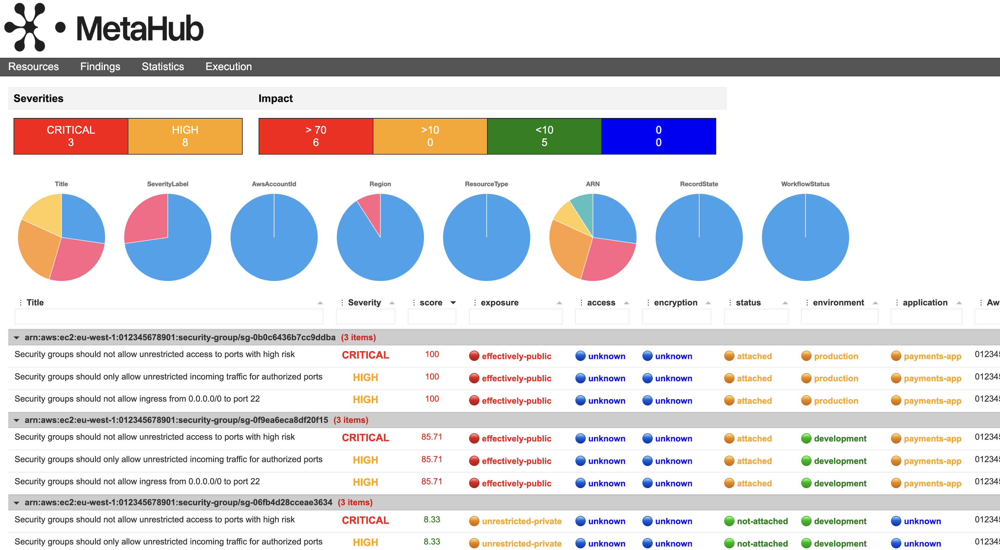

<p align="center">
  
</p>

<p align="center">
  <b>MetaHub</b> is an automated contextual security findings enrichment and impact evaluation tool for vulnerability management. You can use it with AWS Security Hub or any ASFF-compatible security scanner. Stop relying on useless severities and switch to impact scoring definitions based on YOUR context.
</p>

<p align="center">
  <a href="https://gallery.ecr.aws/n2p8q5p4/metahub"></a>
</p>

# Table of Contents

- [Description](#description)
- [Context](#context)
- [Impact](#impact)
- [Architecture](#architecture)
- [Use Cases](#use-cases)
- [Features](#features)
- [Configuration](#customizing-configuration)
- [Run with Python](#run-with-python)
- [Run with Docker](#run-with-docker)
- [Run with Lambda](#run-with-lambda)
- [Run with Security Hub Custom Action](#run-with-security-hub-custom-action)
- [AWS Authentication](#aws-authentication)
- [Configuring Security Hub](#configuring-security-hub)
- [Configuring Context](#configuring-context)
- [Inputs](#Inputs)
- [Output Modes](#output-modes)
- [Filters](#filters)
- [Updating Workflow Status](#updating-workflow-status)
- [Enriching Findings](#enriching-findings)
- [Findings Aggregation](#findings-aggregation)

# Description

**MetaHub** is an open-source security tool for **impact-contextual vulnerability management**. It can automate the process of **contextualizing** security findings based on your environment and your needs: YOUR **context**, identifying **ownership**, and calculate an **impact scoring** based on it that you can use for defining prioritization and automation. You can use it with [AWS Security Hub](https://aws.amazon.com/security-hub) or any [ASFF](https://docs.aws.amazon.com/securityhub/latest/userguide/securityhub-findings-format.html) security scanners (like [Prowler](https://github.com/prowler-cloud/prowler)).

**MetaHub** describe your context by connecting to your affected resources in your affected accounts. It can describe information about your AWS account and organization, the affected resources tags, the affected CloudTrail events, your affected resource configurations, and all their associations: if you are contextualizing a security finding affecting an EC2 Instance, MetaHub will not only connect to that instance itself but also its IAM Roles; from there, it will connect to the IAM Policies associated with those roles. It will connect to the Security Groups and analyze all their rules, the VPC and the Subnets where the instance is running, the Volumes, the Auto Scaling Groups, and more.

After fetching all the information from your context, **MetaHub** will evaluate certain important conditions for all your resources: `exposure`, `access`, `encryption`, `status`, `environment`, `application` and `owner`. Based on those calculations and in addition to the information from the security findings affecting the resource all together, MetaHub will generate a **Scoring** for each finding.

Check the following dashboard generated by MetaHub. You have the affected resources, grouping all the security findings affecting them together and the original severity of the finding. After that, you have the **Impact Score** and all the criteria MetaHub evaluated to generate that score. All this information is filterable, sortable, groupable, downloadable, and customizable.



You can rely on this **Impact Score** for prioritizing findings (where should you start?), directing attention to critical issues, and automating alerts and escalations.

**MetaHub** can also filter, deduplicate, group, report, suppress, or update your security findings in automated workflows. It is designed for use as a CLI tool or within automated workflows, such as AWS Security Hub custom actions or AWS Lambda functions.

The following is the JSON output for a an EC2 instance; see how MetaHub organizes all the information about its context together, under `associations`, `config`, `tags`, `account` `cloudtrail`, and `impact`

<p align="center">
  
</p>

# Context

In **MetaHub**, context refers to information about the affected resources like their configuration, associations, logs, tags, account, and more.

MetaHub doesn't stop at the affected resource but analyzes any associated or attached resources. For instance, if there is a security finding on an EC2 instance, MetaHub will not only analyze the instance but also the security groups attached to it, including their rules. MetaHub will examine the IAM roles that the affected resource is using and the policies attached to those roles for any issues. It will analyze the EBS attached to the instance and determine if they are encrypted. It will also analyze the Auto Scaling Groups that the instance is associated with and how. MetaHub will also analyze the VPC, Subnets, and other resources associated with the instance.

The **Context** module has the capability to retrieve information from the affected resources, affected accounts, and every associated resources. The context module has five main parts: `config` (which includes `associations` as well), `tags`, `cloudtrail`, and `account`. By default `config` and `tags` are enabled, but you can change this behavior using the option `--context` (for enabling all the context modules you can use `--context config tags cloudtrail account`). The output of each enabled key will be added under the affected resource.

- [Config](#config)
- [Associations](#associations)
- [Tags](#tags)
- [CloudTrail](#cloudtrail)
- [Account](#account)

## Config

Under the `config` key, you can find anyting related to the configuration of the affected resource. For example, if the affected resource is an EC2 Instance, you will see keys like `private_ip`, `public_ip`, or `instance_profile`.

You can filter your findings based on Config outputs using the option: `--mh-filters-config <key> {True/False}`. See [Config Filters](#config-filters).

## Associations

Under the `associations` key, you will find all the associated resources of the affected resource. For example, if the affected resource is an EC2 Instance, you will find resources like: Security Groups, IAM Roles, Volumes, VPC, Subnets, Auto Scaling Groups, etc. Each time MetaHub finds an association, it will connect to the associated resource again and fetch its own context.

Associations are key to understanding the context and impact of your security findings as their exposure.

You can filter your findings based on Associations outputs using the option: `--mh-filters-config <key> {True/False}`. See [Config Filters](#config-filters).

## Tags

**MetaHub** relies on [AWS Resource Groups Tagging API](https://docs.aws.amazon.com/resourcegroupstagging/latest/APIReference/overview.html) to query the tags associated with your resources.

Note that not all AWS resource type supports this API. You can check [supported services](https://docs.aws.amazon.com/resourcegroupstagging/latest/APIReference/supported-services.html).

Tags are a crucial part of understanding your context. Tagging strategies often include:

- Environment (like Production, Staging, Development, etc.)
- Data classification (like Confidential, Restricted, etc.)
- Owner (like a team, a squad, a business unit, etc.)
- Compliance (like PCI, SOX, etc.)

If you follow a proper tagging strategy, you can filter and generate interesting outputs. For example, you could list all findings related to a specific team and provide that data directly to that team.

You can filter your findings based on Tags outputs using the option: `--mh-filters-tags TAG=VALUE`. See [Tags Filtering](#tags-filtering)

## CloudTrail

Under the key `cloudtrail`, you will find critical Cloudtrail events related to the affected resource, such as creating events.

The Cloudtrail events that we look for are defined by resource type, and you can add, remove or change them by editing the configuration file [resources.py](lib/config/resources.py).

For example for an affected resource of type Security Group, MetaHub will look for the following events:

- `CreateSecurityGroup`: Security Group Creation event
- `AuthorizeSecurityGroupIngress`: Security Group Rule Authorization event.

## Account

Under the key `account`, you will find information about the account where the affected resource is runnning, like if it's part of an AWS Organizations, information about their contacts, etc.

# Impact

The impact module in MetaHub focuses on generating a score for each finding based on the context of the affected resource and all the security findings affecting them and their severities together. The impact score is a number between 0 and 100, where 100 is the highest impact.

The formula for getting the impact score include the following criteria:

- [Exposure](#exposure)
- [Access](#access)
- [Encryption](#encryption)
- [Status](#status)
- [Environment](#environment)
- [Application](#application)
- [Owner](#owner)
- [Findings](#findings)

## Exposure

**Exposure** evaluates the how the the affected resource is exposed to other networks. For example, if the affected resource is public, if it is part of a VPC, if it has a public IP or if it is protected by a firewall or a security group.

| **Possible Statuses**   | **Value** | **Description**                                                                                                |
| ----------------------- | :-------: | -------------------------------------------------------------------------------------------------------------- |
| 🔴 effectively-public   |   100%    | The resource is effectively public from the Internet.                                                          |
| 🟠 restricted-public    |    40%    | The resource is public, but there is a restriction like a Security Group.                                      |
| 🟠 unrestricted-private |    30%    | The resource is private but unrestricted, like an open security group.                                         |
| 🟠 launch-public        |    10%    | These are resources that can launch other resources as public. For example, an Auto Scaling group or a Subnet. |
| 🟢 restricted           |    0%     | The resource is restricted.                                                                                    |
| 🔵 unknown              |     -     | The resource couldn't be checked                                                                               |

## Access

**Access** evaluates the resource policy layer. MetaHub checks every available policy including: IAM Managed policies, IAM Inline policies, Resource Policies, Bucket ACLS, and any association to other resources like IAM Roles which its policies are also analyzed . An unrestricted policy is not only an itsue itself of that policy, it afected any other resource which is using it.

| **Possible Statuses**      | **Value** | **Description**                                                                                                                              |
| -------------------------- | :-------: | -------------------------------------------------------------------------------------------------------------------------------------------- |
| 🔴 unrestricted            |   100%    | The principal is unrestricted, without any condition or restriction.                                                                         |
| 🔴 untrusted-principal     |    70%    | The principal is an AWS Account, not part of your trusted accounts.                                                                          |
| 🟠 unrestricted-principal  |    40%    | The principal is not restricted, defined with a wildcard. It could be conditions restricting it or other restrictions like s3 public blocks. |
| 🟠 cross-account-principal |    30%    | The principal is from another AWS account.                                                                                                   |
| 🟠 unrestricted-actions    |    30%    | The actions are defined using wildcards.                                                                                                     |
| 🟠 dangerous-actions       |    30%    | Some dangerous actions are defined as part of this policy.                                                                                   |
| 🟠 unrestricted-service    |    10%    | The policy allows an AWS service as principal without restriction.                                                                           |
| 🟢 restricted              |    0%     | The policy is restricted.                                                                                                                    |
| 🔵 unknown                 |     -     | The policy couldn't be checked.                                                                                                              |

## Encryption

**Encryption** evaluate the different encryption layers based on each resource type. For example, for some resources it evaluates if `at_rest` and `in_transit` encryption configuration are both enabled.

| **Possible Statuses** | **Value** | **Description**                                                     |
| --------------------- | :-------: | ------------------------------------------------------------------- |
| 🔴 unencrypted        |   100%    | The resource is not fully encrypted.                                |
| 🟢 encrypted          |    0%     | The resource is fully encrypted including any of it's associations. |
| 🔵 unknown            |     -     | The resource encryption couldn't be checked.                        |

## Status

**Status** evaluate the status of the affected resource in terms of attachment or functioning. For example, for an EC2 Instance we evaluate if the resource is running, stopped, or terminated, but for resources like EBS Volumes and Security Groups, we evaluate if those resources are attached to any other resource.

| **Possible Statuses** | **Value** | **Description**                                           |
| --------------------- | :-------: | --------------------------------------------------------- |
| 🟠 attached           |   100%    | The resource supports attachment and is attached.         |
| 🟠 running            |   100%    | The resource supports running and is running.             |
| 🟠 enabled            |   100%    | The resource supports enabled and is enabled.             |
| 🟢 not-attached       |    0%     | The resource supports attachment, and it is not attached. |
| 🟢 not-running        |    0%     | The resource supports running and it is not running.      |
| 🟢 not-enabled        |    0%     | The resource supports enabled and it is not enabled.      |
| 🔵 unknown            |     -     | The resource couldn't be checked for status.              |

## Environment

**Environment** evaluates the environment where the affected resource is running. By default, MetaHub defines 3 environments: `production`, `staging`, and `development`, but you can add, remove, or modify these environments based on your needs. MetaHub evaluates the environment based on the tags of the affected resource, the account id or the account alias. You can define your own environemnts definitions and strategy in the configuration file (See [Customizing Configuration](#customizing-configuration)).

| **Possible Statuses** | **Value** | **Description**                                  |
| --------------------- | :-------: | ------------------------------------------------ |
| 🟠 production         |   100%    | It is a production resource.                     |
| 🟢 staging            |    30%    | It is a staging resource.                        |
| 🟢 development        |    0%     | It is a development resource.                    |
| 🔵 unknown            |     -     | The resource couldn't be checked for enviroment. |

## Application

**Application** evaluates the application that the affected resource is part of. MetaHub relies on the AWS [myApplications](https://docs.aws.amazon.com/awsconsolehelpdocs/latest/gsg/aws-myApplications.html) feature, which relies on the Tag `awsApplication`, but you can extend this functionality based on your context for example by defining other tags you use for defining applications or services (like `Service` or any other), or by relying on account id or alias. You can define your application definitions and strategy in the configuration file (See [Customizing Configuration](#customizing-configuration)).

| **Possible Statuses** | **Value** | **Description**                                   |
| --------------------- | :-------: | ------------------------------------------------- |
| 🔵 unknown            |     -     | The resource couldn't be checked for application. |

## Owner

**Owner** focuses on ownership detection. It can determine the owner of the affected resource in various ways. This information can be used to automatically assign a security finding to the correct owner, escalate it, or make decisions based on this information. An automated way to determine the owner of a resource is critical for security teams. It allows them to focus on the most critical issues and assign them as fast as possible to the right people in automated workflows. You can define your owner definitions and strategy in the configuration file (See [Customizing Configuration](#customizing-configuration)).

| **Possible Statuses** | **Value** | **Description**                             |
| --------------------- | :-------: | ------------------------------------------- |
| 🔵 unknown            |     -     | The resource couldn't be checked for owner. |

## Findings

As part of the impact score calculation, we also evaluate the total ammount of security findings and their severities affecting the resource. We use the following formula to calculate this metric:

```sh
(SUM of all (Finding Severity / Highest Severity) with a maximum of 1)
```

For example, if the affected resource has two findings affecting it, one with `HIGH` and another with `LOW` severity, the **Impact Findings Score** will be:

```sh
SUM(HIGH (3) / CRITICAL (4) + LOW (0.5) / CRITICAL (4)) = 0.875
```

# High level architecture

**MetaHub** reads your security findings from AWS Security Hub or any ASFF-compatible security scanner. It then queries the affected resources directly in the affected account to provide additional context. Based on that context, it calculates it's impact. Finally, it generates different outputs based on your needs.

<p align="center">
  
</p>

# Use Cases

Some use cases for MetaHub include:

- [MetaHub integration with Prowler as a local scanner for context enrichment](https://medium.com/@gabriel_87/metahub-use-cases-part-i-metahub-integration-with-prowler-as-a-local-scanner-for-context-f3540e18eaa1)
- Automating Security Hub findings suppression based on Tagging
- Integrate MetaHub directly as Security Hub custom action to use it directly from the AWS Console
- Created enriched HTML reports for your findings that you can filter, sort, group, and download
- Create Security Hub Insights based on MetaHub context

# Features

**MetaHub** provides a range of ways to list and manage security findings for investigation, suppression, updating, and integration with other tools or alerting systems. To avoid _Shadowing_ and _Duplication_, MetaHub organizes related findings together when they pertain to the same resource. For more information, refer to [Findings Aggregation](#findings-aggregation)

**MetaHub** queries the affected resources directly in the affected account to provide additional **context** using the following options:

- **[Config](#Config)**: Fetches the most important configuration values from the affected resource.
- **[Associations](#Associations)**: Fetches all the associations of the affected resource, such as IAM roles, security groups, and more.
- **[Tags](#Tags)**: Queries tagging from affected resources
- **[CloudTrail](#CloudTrail)**: Queries CloudTrail in the affected account to identify who created the resource and when, as well as any other related critical events
- **[Account](#Account)**: Fetches extra information from the account where the affected resource is running, such as the account name, security contacts, and other information.

**MetaHub** supports filters on top of these context\* outputs to automate the detection of other resources with the same issues. You can filter security findings affecting resources tagged in a certain way (e.g., `Environment=production`) and combine this with filters based on Config or Associations, like, for example, if the resource is public, if it is encrypted, only if they are part of a VPC, if they are using a specific IAM role, and more. For more information, refer to **[Config filters](#config-filters)** and **[Tags filters](#tags-filters)** for more information.

But that's not all. If you are using **MetaHub** with Security Hub, you can even combine the previous filters with the Security Hub native filters (**[AWS Security Hub filtering](security-hub-filtering)**). You can filter the same way you would with the AWS CLI utility using the option `--sh-filters`, but in addition, you can save and re-use your filters as YAML files using the option `--sh-template`.

If you prefer, With **MetaHub**, you can back **[enrich your findings directly in AWS Security Hub](#enriching-findings)** using the option `--enrich-findings`. This action will update your AWS Security Hub findings using the field `UserDefinedFields`. You can then create filters or [Insights](https://docs.aws.amazon.com/securityhub/latest/userguide/securityhub-insights.html) directly in AWS Security Hub and take advantage of the contextualization added by MetaHub.

When investigating findings, you may need to update security findings altogether. **MetaHub** also allows you to execute **[bulk updates](#updating-workflow-status)** to AWS Security Hub findings, such as changing Workflow Status using the option `--update-findings`. As an example, you identified that you have hundreds of security findings about public resources. Still, based on the MetaHub context, you know those resources are not effectively public as they are protected by routing and firewalls. You can update all the findings for the output of your MetaHub query with one command. When updating findings using MetaHub, you also update the field `Note` of your finding with a custom text for future reference.

**MetaHub** supports different **[Output Modes](#output-modes)**, some of them **json based** like **json-inventory**, **json-statistics**, **json-short**, **json-full**, but also powerfull **html**, **xlsx** and **csv**. These outputs are customizable; you can choose which columns to show. For example, you may need a report about your affected resources, adding the tag Owner, Service, and Environment and nothing else. Check the configuration file and define the columns you need.

**MetaHub** supports **multi-account setups**. You can run the tool from any environment by assuming roles in your AWS Security Hub `master` account and your `child/service` accounts where your resources live. This allows you to fetch aggregated data from multiple accounts using your AWS Security Hub multi-account implementation while also fetching and enriching those findings with data from the accounts where your affected resources live based on your needs. Refer to [Configuring Security Hub](#configuring-security-hub) for more information.

# Customizing Configuration

**MetaHub** uses configuration files that let you customize some checks behaviors, default filters, and more. The configuration files are located in [lib/config/](lib/config).

Things you can customize:

- [lib/config/configuration.py](lib/config/configuration.py): This file contains the default configuration for MetaHub. You can change the default filters, the default output modes, the environment definitions, and more.

- [lib/config/impact.py](lib/config/impact.py): This file contains the values and it's weights for the impact formula criteria. You can modify the values and the weights based on your needs.

- [lib/config/reources.py](lib/config/resources.py): This file contains definitions for every resource type, like which CloudTrail events to look for.

# Run with Python

**MetaHub** is a Python3 program. You need to have Python3 installed in your system and the required Python modules described in the file `requirements.txt`.

Requirements can be installed in your system manually (using pip3) or using a Python virtual environment (suggested method).

## Run it using Python Virtual Environment

1. Clone the repository: `git clone git@github.com:gabrielsoltz/metahub.git`
2. Change to repostiory dir: `cd metahub`
3. Create a virtual environment for this project: `python3 -m venv venv/metahub`
4. Activate the virtual environment you just created: `source venv/metahub/bin/activate`
5. Install Metahub requirements: `pip3 install -r requirements.txt`
6. Run: `./metahub -h`
7. Deactivate your virtual environment after you finish with: `deactivate`

Next time, you only need steps 4 and 6 to use the program.

Alternatively, you can run this tool using Docker.

# Run with Docker

MetaHub is also available as a Docker image. You can run it directly from the public Docker image or build it locally.

The available tagging for MetaHub containers are the following:

- `latest`: in sync with master branch
- `<x.y.z>`: you can find the releases [here](https://github.com/gabrielsoltz/metahub/releases)
- `stable`: this tag always points to the latest release.

For running from the public registry, you can run the following command:

```sh
docker run -ti public.ecr.aws/n2p8q5p4/metahub:latest ./metahub -h
```

## AWS credentials and Docker

If you are already logged into the AWS host machine, you can seamlessly use the same credentials within a Docker container. You can achieve this by either passing the necessary environment variables to the container or by mounting the credentials file.

For instance, you can run the following command:

```sh
docker run -e AWS_DEFAULT_REGION -e AWS_ACCESS_KEY_ID -e AWS_SECRET_ACCESS_KEY -e AWS_SESSION_TOKEN -ti public.ecr.aws/n2p8q5p4/metahub:latest ./metahub -h
```

On the other hand, if you are not logged in on the host machine, you will need to log in again from within the container itself.

## Build and Run Docker locally

Or you can also build it locally:

```sh
git clone git@github.com:gabrielsoltz/metahub.git
cd metahub
docker build -t metahub .
docker run -ti metahub ./metahub -h
```

# Run with Lambda

**MetaHub** is Lambda/Serverless ready! You can run MetaHub directly on an AWS Lambda function without any additional infrastructure required.

Running MetaHub in a Lambda function allows you to automate its execution based on your defined triggers. For example, you can:

- Trigger the MetaHub Lambda function each time there is a new security finding to enrich that finding back in AWS Security Hub.
- Trigger the MetaHub Lambda function each time there is a new security finding for suppression based on Context.
- Trigger the MetaHub Lambda function to identify the affected owner of a security finding based on Context and assign it using your internal systems.
- Trigger the MetaHub Lambda function to create a ticket with enriched context.

## Deploying Lambda

The terraform code for deploying the Lambda function is provided under the `terraform/` folder.

Just run the following commands:

```sh
cd terraform
terraform init
terraform apply
```

The code will create a zip file for the Lambda code and a zip file for the Python dependencies that we will use as Lambda layer. It will also create the Lambda function and all the required resources.

The Terraform code will also create a Security Hub custom action and an EventBridge rule to trigger the Lambda function when the custom action is executed. See below.

## Customize Lambda behaviour

You can customize MetaHub options for your lambda by editing the file [lib/lambda.py](lib/lambda.py). You can change the default options for MetaHub, such as the filters, the Meta\* options, and more.

## Lambda Permissions

Terraform will create the minimum required permissions for the Lambda function to run locally (in the same account). If you want your Lambda to assume a role in other accounts (for example, you will need this if you are executing the Lambda in the Security Hub master account that is aggregating findings from other accounts), you will need to specify the role to assume, adding the option `--mh-assume-role` in the Lambda function configuration (See previous step) and adding the corresponding policy to allow the Lambda to assume that role in the lambda role.

# Run with Security Hub Custom Action

**MetaHub** can be run as a [Security Hub Custom Action](https://docs.aws.amazon.com/securityhub/latest/userguide/securityhub-cwe-custom-actions.html). This allows you to run MetaHub directly from the Security Hub console for a selected finding or for a selected set of findings.

<p align="center">
  
</p>

The custom action will then trigger a Lambda function that will run MetaHub for the selected findings.

When you trigger the Lambda using the Security Hub Custom Action, the lambda will read the selected findings for it's context, and it will execute once for each finding. By default, no action will be taken on the findings, but you can change this behavior. See [Customize Lambda behavior](#customize-lambda-behaviour).

The Security Hub custom action is deployed as part of the Terraform code. See [Deploying Lambda](#deploying-lambda) for more information.

<details>
  <summary>If you want to deploy it manually, you can follow the steps below:</summary>
1. In Security Hub, choose Settings and then choose Custom Actions.
2. Choose Create custom action.
3. Provide a Name, Description, and Custom action ID for the action.
4. Choose Create custom action. (Make a note of the Custom action ARN. You need to use the ARN when you create a rule to associate with this action in EventBridge.)
5. In EventBridge, choose Rules and then choose Create rule.
6. Enter a name and description for the rule.
7. For the Event bus, choose the event bus that you want to associate with this rule. If you want this rule to match events that come from your account, select default. When an AWS service in your account emits an event, it always goes to your account's default event bus.
8. For Rule type, choose a rule with an event pattern and then press Next.
9. For Event source, choose AWS events.
10. For the Creation method, choose Use pattern form.
11. For Event source, choose AWS services.
12. For AWS service, choose Security Hub.
13. For Event type, choose Security Hub Findings - Custom Action.
14. Choose Specific custom action ARNs and add a custom action ARN.
15. Choose Next.
16. Under Select targets, choose the Lambda function
17. Select the Lambda function you created for MetaHub.
</details>

# AWS Authentication

- Ensure you have AWS credentials set up on your local machine (or from where you will run MetaHub).

For example, you can use `aws configure` option.

```sh
aws configure
```

Or you can export your credentials to the environment.

```sh
export AWS_DEFAULT_REGION="us-east-1"
export AWS_ACCESS_KEY_ID= "ASXXXXXXX"
export AWS_SECRET_ACCESS_KEY= "XXXXXXXXX"
export AWS_SESSION_TOKEN= "XXXXXXXXX"
```

# Configuring Security Hub

- If you are running MetaHub for a single AWS account setup (AWS Security Hub is not aggregating findings from different accounts), you don't need to use any additional options; MetaHub will use the credentials in your environment. Still, if your IAM design requires it, it is possible to log in and assume a role in the same account you are logged in. Just use the options `--sh-assume-role` to specify the role and `--sh-account` with the same AWS Account ID where you are logged in.

- `--sh-region`: The AWS Region where Security Hub is running. If you don't specify a region, it will use the one configured in your environment. If you are using AWS Security Hub Cross-Region aggregation, you should use that region as the --sh-region option so that you can fetch all findings together.

- `--sh-account` and `--sh-assume-role`: The AWS Account ID where Security Hub is running and the AWS IAM role to assume in that account. These options are helpful when you are logged in to a different AWS Account than the one where AWS Security Hub is running or when running AWS Security Hub in a multiple AWS Account setup. Both options must be used together. The role provided needs to have enough policies to get and update findings in AWS Security Hub (if needed). If you don't specify a `--sh-account`, MetaHub will assume the one you are logged in.

- `--sh-profile`: You can also provide your AWS profile name to use for AWS Security Hub. When using this option, you don't need to specify `--sh-account` or `--sh-assume-role` as MetaHub will use the credentials from the profile. If you are using `--sh-account` and `--sh-assume-role`, those options take precedence over `--sh-profile`.

## IAM Policy for Security Hub

This is the minimum IAM policy you need to read and write from AWS Security Hub. If you don't want to update your findings with MetaHub, you can remove the `securityhub:BatchUpdateFindings` action.

```sh
{
    "Version": "2012-10-17",
    "Statement": [
        {
            "Effect": "Allow",
            "Action": [
                "security hub:GetFindings",
                "security hub:ListFindingAggregators",
                "security hub:BatchUpdateFindings",
                "iam:ListAccountAliases"
            ],
            "Resource": [
                "*"
            ]
        }
    ]
}
```

# Configuring Context

If you are running MetaHub for a multiple AWS Account setup (AWS Security Hub is aggregating findings from multiple AWS Accounts), you must provide the role to assume for Context queries because the affected resources are not in the same AWS Account that the AWS Security Hub findings. The `--mh-assume-role` will be used to connect with the affected resources directly in the affected account. This role needs to have enough policies for being able to describe resources.

## IAM Policy for Context

The minimum policy needed for context includes the managed policy `arn:aws:iam::aws:policy/SecurityAudit` and the following actions:

- `tag:GetResources`
- `lambda:GetFunction`
- `lambda:GetFunctionUrlConfig`
- `cloudtrail:LookupEvents`
- `account:GetAlternateContact`
- `organizations:DescribeAccount`
- `iam:ListAccountAliases`

# Inputs

MetaHub can read security findings directly from AWS Security Hub using its API. If you don't use Security Hub, you can use any ASFF-based scanner. Most cloud security scanners support the ASFF format. Check with them or leave an issue if you need help.

If you want to read from an input ASFF file, you need to use the options:

```sh
./metahub.py --inputs file-asff --input-asff path/to/the/file.json.asff path/to/the/file2.json.asff
```

You also can combine AWS Security Hub findings with input ASFF files specifying both inputs:

```sh
./metahub.py --inputs file-asff securityhub --input-asff path/to/the/file.json.asff
```

When using a file as input, you can't use the option `--sh-filters` for filter findings, as this option relies on AWS API for filtering. You can't use the options `--update-findings` or `--enrich-findings` as those findings are not in the AWS Security Hub. If you are reading from both sources at the same time, only the findings from AWS Security Hub will be updated.

# Output Modes

**MetaHub** can generate different programmatic and visual outputs. By default, all output modes are enabled: `json-short`, `json-full`, `json-statistics`, `json-inventory`, `html`, `csv`, and `xlsx`.

The outputs will be saved in the `outputs/` folder with the execution date.

If you want only to generate a specific output mode, you can use the option `--output-modes` with the desired output mode.

For example, if you only want to generate the output `json-short`, you can use:

```sh
./metahub.py --output-modes json-short
```

If you want to generate `json-short`, `json-full` and `html` outputs, you can use:

```sh
./metahub.py --output-modes json-short json-full html
```

- [JSON](#json)
- [HTML](#html)
- [CSV](#csv)
- [XLSX](#xlsx)

## JSON

### JSON-Short

Show all findings titles together under each affected resource and the `AwsAccountId`, `Region`, and `ResourceType`:

```
"arn:aws:sagemaker:us-east-1:ofuscated:notebook-instance/obfuscated": {
  "findings": [
    "SageMaker.2 SageMaker notebook instances should be launched in a custom VPC",
    "SageMaker.3 Users should not have root access to SageMaker notebook instances",
    "SageMaker.1 Amazon SageMaker notebook instances should not have direct internet access"
  ],
  "AwsAccountId": "obfuscated",
  "Region": "us-east-1",
  "ResourceType": "AwsSageMakerNotebookInstance",
  "config: {},
  "associations: {},
  "tags: {},
  "cloudtrail: {},
  "account: {}
  "impact: {}
},
```

### JSON-Full

Show all findings with all data. Findings are organized by ResourceId (ARN). For each finding, you will also get: `SeverityLabel,` `Workflow,` `RecordState,` `Compliance,` `Id`, and `ProductArn`:

```
"arn:aws:sagemaker:eu-west-1:ofuscated:notebook-instance/obfuscated": {
  "findings": [
    {
      "SageMaker.3 Users should not have root access to SageMaker notebook instances": {
        "SeverityLabel": "HIGH",
        "Workflow": {
          "Status": "NEW"
        },
        "RecordState": "ACTIVE",
        "Compliance": {
          "Status": "FAILED"
        },
        "Id": "arn:aws:security hub:eu-west-1:ofuscated:subscription/aws-foundational-security-best-practices/v/1.0.0/SageMaker.3/finding/12345-0193-4a97-9ad7-bc7c1730eec6",
        "ProductArn": "arn:aws:security hub:eu-west-1::product/aws/security hub"
      }
    },
    {
      "SageMaker.2 SageMaker notebook instances should be launched in a custom VPC": {
        "SeverityLabel": "HIGH",
        "Workflow": {
          "Status": "NEW"
        },
        "RecordState": "ACTIVE",
        "Compliance": {
          "Status": "FAILED"
        },
        "Id": "arn:aws:security hub:eu-west-1:ofuscated:subscription/aws-foundational-security-best-practices/v/1.0.0/SageMaker.2/finding/12345-e8e1-4915-9881-965104b0aabf",
        "ProductArn": "arn:aws:security hub:eu-west-1::product/aws/security hub"
      }
    },
    {
      "SageMaker.1 Amazon SageMaker notebook instances should not have direct internet access": {
        "SeverityLabel": "HIGH",
        "Workflow": {
          "Status": "NEW"
        },
        "RecordState": "ACTIVE",
        "Compliance": {
          "Status": "FAILED"
        },
        "Id": "arn:aws:security hub:eu-west-1:ofuscated:subscription/aws-foundational-security-best-practices/v/1.0.0/SageMaker.1/finding/12345-3a21-4016-a8e5-f5173b44e90a",
        "ProductArn": "arn:aws:security hub:eu-west-1::product/aws/security hub"
      }
    }
  ],
  "AwsAccountId": "obfuscated",
  "Region": "eu-west-1",
  "ResourceType": "AwsSageMakerNotebookInstance",
  "config: {},
  "associations: {},
  "tags: {},
  "cloudtrail: {},
  "account: {}
  "impact: {}
},
```

### JSON-Inventory

Show a list of all resources with their ARN.

```
[
  "arn:aws:sagemaker:us-east-1:ofuscated:notebook-instance/obfuscated",
  "arn:aws:sagemaker:eu-west-1:ofuscated:notebook-instance/obfuscated"
]
```

### JSON-Statistics

Show statistics for each field/value. In the output, you will see each field/value and the number of occurrences; for example, the following output shows statistics for six findings.

```
{
  "Title": {
    "SageMaker.1 Amazon SageMaker notebook instances should not have direct internet access": 2,
    "SageMaker.2 SageMaker notebook instances should be launched in a custom VPC": 2,
    "SageMaker.3 Users should not have root access to SageMaker notebook instances": 2,
  },
  "SeverityLabel": {
    "HIGH": 6
  },
  "Workflow": {
    "NEW": 6
  },
  "RecordState": {
    "ACTIVE": 6
  },
  "Compliance": {
    "FAILED": 6
  },
  "ProductArn": {
    "arn:aws:security hub:eu-west-1::product/aws/security hub": 3,
    "arn:aws:security hub:us-east-1::product/aws/security hub": 3
  },
  "ResourceType": {
    "AwsSageMakerNotebookInstance": 6
  },
  "AwsAccountId": {
    "obfuscated": 6
  },
  "Region": {
    "eu-west-1": 3,
    "us-east-1": 3
  },
  "ResourceId": {
    "arn:aws:sagemaker:eu-west-1:ofuscated:notebook-instance/obfuscated": 3,
    "arn:aws:sagemaker:us-east-1:ofuscated:notebook-instance/obfuscated": 3
  }
}
```

## HTML

You can create rich HTML reports of your findings, adding your context as part of them.

HTML Reports are interactive in many ways:

- You can add/remove columns.
- You can sort and filter by any column.
- You can auto-filter by any column
- You can group/ungroup findings
- You can also download that data to xlsx, CSV, HTML, and JSON.

<p align="center">
  
</p>

## CSV

You can create CSV reports of your findings, adding your context as part of them.

<p align="center">
  
</p>

## XLSX

Similar to CSV but with more formatting options.

<p align="center">
  
</p>

## Customize HTML, CSV or XLSX outputs

You can customize which Context keys to unroll as columns for your HTML, CSV, and XLSX outputs using the options `--output-tag-columns` and `--output-config-columns` (as a list of columns). If the keys you specified don't exist for the affected resource, they will be empty. You can also configure these columns by default in the configuration file (See [Customizing Configuration](#customizing-configuration)).

For example, you can generate an HTML output with Tags and add "Owner" and "Environment" as columns to your report using the:

```sh
./metahub --output-modes html --output-tag-columns Owner Environment
```

# Filters

You can filter the security findings and resources that you get from your source in different ways and combine all of them to get exactly what you are looking for, then re-use those filters to create alerts.

- [Security Hub Filtering](#security-hub-filtering)
- [Security Hub Filtering using YAML templates](#security-hub-filtering-using-yaml-templates)
- [Config Filters](#config-filters)
- [Tags Filters](#tags-filters)

## Security Hub Filtering

MetaHub supports filtering AWS Security Hub findings in the form of `KEY=VALUE` filtering for AWS Security Hub using the option `--sh-filters`, the same way you would filter using AWS CLI but limited to the `EQUALS` comparison. If you want another comparison, use the option `--sh-template` [Security Hub Filtering using YAML templates](#security-hub-filtering-using-yaml-templates).

You can check available filters in [AWS Documentation](https://boto3.amazonaws.com/v1/documentation/api/latest/reference/services/securityhub.html#SecurityHub.Client.get_findings)

```sh
./metahub --sh-filters <KEY=VALUE>
```

If you don't specify any filters, default filters are applied: `RecordState=ACTIVE WorkflowStatus=NEW`

Passing filters using this option resets the default filters. If you want to add filters to the defaults, you need to specify them in addition to the default ones. For example, adding SeverityLabel to the default filters:

```sh
./metahub --sh-filters RecordState=ACTIVE WorkflowStatus=NEW
```

If a value contains spaces, you should specify it using double quotes: `"ProductName="Security Hub"`

You can add how many different filters you need to your query and also add the same filter key with different values:

Examples:

- Filter by Severity (CRITICAL):

```sh
./metaHub --sh-filters RecordState=ACTIVE WorkflowStatus=NEW SeverityLabel=CRITICAL
```

- Filter by Severity (CRITICAL and HIGH):

```sh
./metaHub --sh-filters RecordState=ACTIVE WorkflowStatus=NEW SeverityLabel=CRITICAL SeverityLabel=HIGH
```

- Filter by Severity and AWS Account:

```sh
./metaHub --sh-filters RecordState=ACTIVE WorkflowStatus=NEW SeverityLabel=CRITICAL AwsAccountId=1234567890
```

- Filter by Check Title:

```sh
./metahub --sh-filters RecordState=ACTIVE WorkflowStatus=NEW Title="EC2.22 Unused EC2 security groups should be removed"
```

- Filter by AWS Resource Type:

```sh
./metahub --sh-filters RecordState=ACTIVE WorkflowStatus=NEW ResourceType=AwsEc2SecurityGroup
```

- Filter by Resource ID:

```sh
./metahub --sh-filters RecordState=ACTIVE WorkflowStatus=NEW ResourceId="arn:aws:ec2:eu-west-1:01234567890:security-group/sg-01234567890"
```

- Filter by Finding Id:

```sh
./metahub --sh-filters Id="arn:aws:security hub:eu-west-1:01234567890:subscription/aws-foundational-security-best-practices/v/1.0.0/EC2.19/finding/01234567890-1234-1234-1234-01234567890"
```

- Filter by Compliance Status:

```sh
./metahub --sh-filters ComplianceStatus=FAILED
```

## Security Hub Filtering using YAML templates

**MetaHub** lets you create complex filters using YAML files (templates) that you can re-use when needed. YAML templates let you write filters using any comparison supported by AWS Security Hub like "EQUALS' | 'PREFIX' | 'NOT_EQUALS' | 'PREFIX_NOT_EQUALS". You can call your YAML file using the option `--sh-template <<FILE>>`.

You can find examples under the folder [templates](templates)

- Filter using YAML template default.yml:

```sh
./metaHub --sh-template templates/default.yml
```

## Config Filters

**MetaHub** supports **Config filters** (and associations) using `KEY=VALUE` where the value can only be `True` or `False` using the option `--mh-filters-config`. You can use as many filters as you want and separate them using spaces. If you specify more than one filter, you will get all resources that match **all** filters.

Config filters only support `True` or `False` values:

- A Config filter set to **True** means `True` or with data.
- A Config filter set to **False** means `False` or without data.

Config filters run after AWS Security Hub filters:

1. MetaHub fetches AWS Security Findings based on the filters you specified using `--sh-filters` (or the default ones).
2. MetaHub executes Context for the AWS-affected resources based on the previous list of findings
3. MetaHub only shows you the resources that match your `--mh-filters-config`, so it's a subset of the resources from point 1.

Examples:

- Get all Security Groups (`ResourceType=AwsEc2SecurityGroup`) with AWS Security Hub findings that are ACTIVE and NEW (`RecordState=ACTIVE WorkflowStatus=NEW`) only if they are associated to Network Interfaces (`network_interfaces=True`):

```sh
./metahub --sh-filters RecordState=ACTIVE WorkflowStatus=NEW ResourceType=AwsEc2SecurityGroup --mh-filters-config network_interfaces=True
```

- Get all S3 Buckets (`ResourceType=AwsS3Bucket`) only if they are public (`public=True`):

```sh
./metahub --sh-filters ResourceType=AwsS3Bucket --mh-filters-config public=False
```

## Tags Filters

**MetaHub** supports **Tags filters** in the form of `KEY=VALUE` where KEY is the Tag name and value is the Tag Value. You can use as many filters as you want and separate them using spaces. Specifying multiple filters will give you all resources that match **at least one** filter.

Tags filters run after AWS Security Hub filters:

1. MetaHub fetches AWS Security Findings based on the filters you specified using `--sh-filters` (or the default ones).
2. MetaHub executes Tags for the AWS-affected resources based on the previous list of findings
3. MetaHub only shows you the resources that match your `--mh-filters-tags`, so it's a subset of the resources from point 1.

Examples:

- Get all Security Groups (`ResourceType=AwsEc2SecurityGroup`) with AWS Security Hub findings that are ACTIVE and NEW (`RecordState=ACTIVE WorkflowStatus=NEW`) only if they are tagged with a tag `Environment` and value `Production`:

```sh
./metahub --sh-filters RecordState=ACTIVE WorkflowStatus=NEW ResourceType=AwsEc2SecurityGroup --mh-filters-tags Environment=Production
```

# Updating Workflow Status

You can use **MetaHub** to update your AWS Security Hub Findings workflow status (`NOTIFIED,` `NEW,` `RESOLVED,` `SUPPRESSED`) with a single command. You will use the `--update-findings` option to update all the findings from your MetaHub query. This means you can update one, ten, or thousands of findings using only one command. AWS Security Hub API is limited to 100 findings per update. Metahub will split your results into 100 items chucks to avoid this limitation and update your findings beside the amount.

For example, using the following filter: `./metahub --sh-filters ResourceType=AwsSageMakerNotebookInstance RecordState=ACTIVE WorkflowStatus=NEW` I found two affected resources with three finding each making six Security Hub findings in total.

Running the following update command will update those six findings' workflow status to `NOTIFIED` with a Note:

```sh
./metahub --update-findings Workflow=NOTIFIED Note="Enter your ticket ID or reason here as a note that you will add to the finding as part of this update."
```

<p align="center">
  
</p>

<p align="center">
  
</p>

The `--update-findings` will ask you for confirmation before updating your findings. You can skip this confirmation by using the option `--no-actions-confirmation`.

# Enriching Findings

You can use **MetaHub** to enrich back your AWS Security Hub Findings with Context outputs using the option `--enrich-findings`. Enriching your findings means updating them directly in AWS Security Hub. **MetaHub** uses the `UserDefinedFields` field for this.

By enriching your findings directly in AWS Security Hub, you can take advantage of features like Insights and Filters by using the extra information not available in Security Hub before.

For example, you want to enrich all AWS Security Hub findings with `WorkflowStatus=NEW`, `RecordState=ACTIVE`, and `ResourceType=AwsS3Bucket` that are `public=True` with Context outputs:

```sh
./metahub --sh-filters RecordState=ACTIVE WorkflowStatus=NEW ResourceType=AwsS3Bucket --mh-filters-checks public=True --enrich-findings
```

<p align="center">
  
</p>

The `--enrich-findings` will ask you for confirmation before enriching your findings. You can skip this confirmation by using the option `--no-actions-confirmation`.

# Findings Aggregation

Working with Security Findings sometimes introduces the problem of Shadowing and Duplication.

Shadowing is when two checks refer to the same issue, but one in a more generic way than the other one.

Duplication is when you use more than one scanner and get the same problem from more than one.

Think of a Security Group with port 3389/TCP open to 0.0.0.0/0. Let's use Security Hub findings as an example.

If you are using one of the default Security Standards like `AWS-Foundational-Security-Best-Practices,` you will get two findings for the same issue:

- `EC2.18 Security groups should only allow unrestricted incoming traffic for authorized ports`
- `EC2.19 Security groups should not allow unrestricted access to ports with high risk`

If you are also using the standard CIS AWS Foundations Benchmark, you will also get an extra finding:

- `4.2 Ensure no security groups allow ingress from 0.0.0.0/0 to port 3389`

Now, imagine that SG is not in use. In that case, Security Hub will show an additional fourth finding for your resource!

- `EC2.22 Unused EC2 security groups should be removed`

So now you have in your dashboard four findings for one resource!

Suppose you are working with multi-account setups and many resources. In that case, this could result in many findings that refer to the same thing without adding any extra value to your analysis.

**MetaHub** aggregates security findings under the affected resource.

This is how MetaHub shows the previous example with output-mode json-short:

```sh
"arn:aws:ec2:eu-west-1:01234567890:security-group/sg-01234567890": {
  "findings": [
    "EC2.19 Security groups should not allow unrestricted access to ports with high risk",
    "EC2.18 Security groups should only allow unrestricted incoming traffic for authorized ports",
    "4.2 Ensure no security groups allow ingress from 0.0.0.0/0 to port 3389",
    "EC2.22 Unused EC2 security groups should be removed"
  ],
  "AwsAccountId": "01234567890",
  "Region": "eu-west-1",
  "ResourceType": "AwsEc2SecurityGroup"
}
```

This is how MetaHub shows the previous example with output-mode json-full:

```sh
"arn:aws:ec2:eu-west-1:01234567890:security-group/sg-01234567890": {
  "findings": [
    {
      "EC2.19 Security groups should not allow unrestricted access to ports with high risk": {
        "SeverityLabel": "CRITICAL",
        "Workflow": {
          "Status": "NEW"
        },
        "RecordState": "ACTIVE",
        "Compliance": {
          "Status": "FAILED"
        },
        "Id": "arn:aws:security hub:eu-west-1:01234567890:subscription/aws-foundational-security-best-practices/v/1.0.0/EC2.22/finding/01234567890-1234-1234-1234-01234567890",
        "ProductArn": "arn:aws:security hub:eu-west-1::product/aws/security hub"
      }
    },
    {
      "EC2.18 Security groups should only allow unrestricted incoming traffic for authorized ports": {
        "SeverityLabel": "HIGH",
        "Workflow": {
          "Status": "NEW"
        },
        "RecordState": "ACTIVE",
        "Compliance": {
          "Status": "FAILED"
        },
        "Id": "arn:aws:security hub:eu-west-1:01234567890:subscription/aws-foundational-security-best-practices/v/1.0.0/EC2.22/finding/01234567890-1234-1234-1234-01234567890",
        "ProductArn": "arn:aws:security hub:eu-west-1::product/aws/security hub"
      }
    },
    {
      "4.2 Ensure no security groups allow ingress from 0.0.0.0/0 to port 3389": {
        "SeverityLabel": "HIGH",
        "Workflow": {
          "Status": "NEW"
        },
        "RecordState": "ACTIVE",
        "Compliance": {
          "Status": "FAILED"
        },
        "Id": "arn:aws:security hub:eu-west-1:01234567890:subscription/aws-foundational-security-best-practices/v/1.0.0/EC2.22/finding/01234567890-1234-1234-1234-01234567890",
        "ProductArn": "arn:aws:security hub:eu-west-1::product/aws/security hub"
      }
    },
    {
      "EC2.22 Unused EC2 security groups should be removed": {
        "SeverityLabel": "MEDIUM",
        "Workflow": {
          "Status": "NEW"
        },
        "RecordState": "ACTIVE",
        "Compliance": {
          "Status": "FAILED"
        },
        "Id": "arn:aws:security hub:eu-west-1:01234567890:subscription/aws-foundational-security-best-practices/v/1.0.0/EC2.22/finding/01234567890-1234-1234-1234-01234567890",
        "ProductArn": "arn:aws:security hub:eu-west-1::product/aws/security hub"
      }
    }
  ],
  "AwsAccountId": "01234567890",
  "AwsAccountAlias": "obfuscated",
  "Region": "eu-west-1",
  "ResourceType": "AwsEc2SecurityGroup"
}
```

Your findings are combined under the ARN of the resource affected, ending in only one result or one non-compliant resource.

You can now work in MetaHub with all these four findings together as if they were only one. For example, you can update these four Workflow Status findings using only one command: See [Updating Workflow Status](#updating-workflow-status)

# Contributing

You can follow this guide if you want to contribute to the Context module [guide](docs/context.md).
