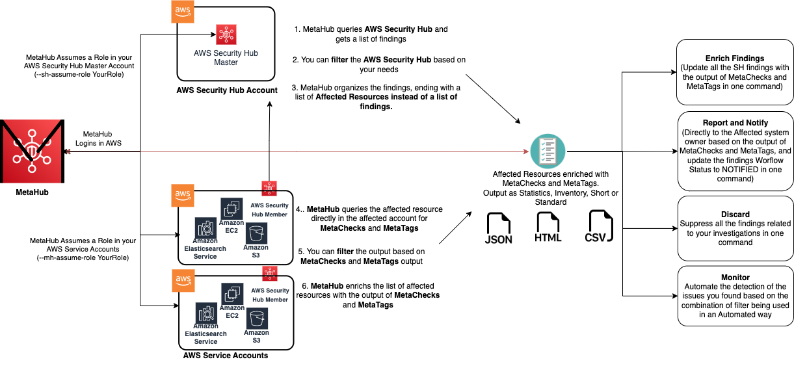

# MetaHub

<p align="center">
  
</p>

<p align="center">
  <b>MetaHub</b> is the command line utility for AWS Security Hub.
</p>

## Table of Contents

- [Description](#description)
- [Features](#features)
- [Examples](#investigations-examples)
- [Requirements](#requirements)
- [AWS Authentication](#aws-authentication)
- [Usage](#usage)
- [Advanced Usage](#advanced-usage)
- [Outputs](#Outputs)
- [Findings Aggregation](#findings-aggregation)
- [MetaChecks](#MetaChecks)
- [MetaTags](#MetaTags)
- [Filtering](#Filtering)
- [Updating Findings](#Updating-Findings)

## Description

**MetaHub** is a command line utility for [AWS Security Hub](https://aws.amazon.com/security-hub). Using **MetaHub**, you can perform your investigations on top no matter what amount of product sources, standards, checks, or findings you have for identifying real and false positives, grouping related findings, and enriching them with data about your context.

**MetaHub** provides you with a framework to do this investigation with the help of **MetaChecks** and **MetaTags** (**your** context). 

**MetaChecks** are provided for some resource types as part of the tool. Still, you can add your custom checks or connect to another specific tooling, like Nmap, to further enrich your investigation and run automation on top of them. 

**MetaTags** are added to your affected resources using different API calls to standarize you Tagging strategy and filter, aggregate or correlate on top of it.

**MetaHub** aggregates by affected resources the information to focus on fixing the real problem, not the findings themselves.

If you are investigating a finding for a Security Group with a port open, you can use MetaHub to investigate and automate the following:

- If there are other findings for this resource
- If the security group is attached to a Network Interface (`is_attached_to_network_interfaces`)
- If the attached resource is public (`is_attached_to_public_ips`)
- If the environment is Production (MetaTags)
- If the port is answering

<p align="center">
  
</p>


## Features

**MetaHub** introduces different **ways of listing AWS Security Hub findings** for investigation, suppression, updating, and integrating with other tools or alerting systems. MetaHub focuses on avoiding **Shadowing** and **Duplication** by organizing the findings together when they are related to the same resource. See [Findings Aggregation](#findings-aggregation)

**MetaHub** queries the affected resources in the affected account directly to add extra information from your context using **MetaChecks** (`--meta-checks`) and **MetaTags** (`--meta-tags`). 

You can define your own **MetaChecks** as yes/no questions using python (is public? is encrypted? is production? is accessed from development?).

**MetaTags** let you enrich your findings with the tags that are associated with the resource by using [AWS Resource Groups Tagging API](https://docs.aws.amazon.com/resourcegroupstagging/latest/APIReference/overview.html). 

You can create a filter on top of these outpus to automate the detection of another resources with the same issues. For example, listing all resources that are effectively public, not encrypted, and are tagged as `Environment=production`. See [MetaChecks](#MetaChecks) and [MetaTags](#MetaTags).

**MetaHub** supports **AWS Security Hub filtering** the same way you would work with CLI utility using the option `--sh-filters` or using YAML templates with the option `--sh-template`. YAML templates let you save your favorite filters and reuse them when you need them for any integration. In addition and combination, it supports **MetaChecks filtering** using the option `--mh-filters-checks` and **MetaTags filtering** using the option `--mh-filters-tags`. The result of your filters is then managed in an aggregate way that lets you update your findings all together when it's necessary or send them to other tools like ticketing or alerting systems. See [Filtering](#Filtering)

**MetaHub** lets you execute **bulk updates** to AWS Security Hub findings, like changing Workflow states using the option (`--update-findings`). You can update your queries' output altogether instead of by one-by-one findings. When updating findings using MetaHub, you are also updating the field `Note` of your finding with a custom text for future reference. See [Updating Findings](#Updating-Findings)

**MetaHub** supports different **outputs** like `inventory`, `statistics`, `short`, or `standard`. All outputs are programmatically usable to be integrated with your favorite tools. See [Outputs](#Outputs). You can also export your outputs to Json, CSV and HTML formats.

**MetaHub** supports **multi-account setups**, letting you run the tool from any environment by assuming roles in your AWS Security Hub master account and in your child/service accounts where your resources live. This allows you to fetch aggregated data from multiple accounts using your AWS Security Hub master implementation while also fetching and enriching those findings with data from the accounts where your affected resources live based on your needs. See [Advanced Usage](#advanced-usage)

## Investigations Examples

### Investigating security findings using Security Hub filters

- List all affected resources by AWS Security Hub findings with default filters (`RecordState=ACTIVE WorkflowStatus=NEW ProductName="Security Hub"`):
`./metahub --list-findings`

- Show the statistics ouptut:
`./metahub --list-findings --output statistics`

- Filter only one resource:
`./metahub --list-findings --sh-filters RecordState=ACTIVE ResourceId=<<ARN>>`

- Filter only one AWS Account and show statistics:
`./metahub --list-findings --sh-filters RecordState=ACTIVE AwsAccountId=<<Account Id>> --output statistics`

### Investigating resources based on MetaTags (Tagging)

- List all affected resources by AWS Security Hub findings and enrich them with MetaTags (Tagging):
`./metahub --list-findings --meta-tags`

- Filter only the affected resources that has a Tag "Environment" with value "Production"
`./metahub --list-findings --meta-tags --mh-filters-tags Environment=production`

- Filter only the affected resources that has a Tag "Environment" with value "Production" wich are HIGH severity:
`./metahub --list-findings --sh-filters RecordState=ACTIVE SeverityLabel=HIGH --meta-tags --mh-filters-tags Environment=production`

### Investigating resources based on MetaChecks

- List all MetaChecks available:
`./metahub --list-findings --list-meta-checks`

- List all affected resources by AWS Security Hub findings and enrich them with MetaChecks:
`./metahub --list-findings --meta-checks`

- Filter only the affected resoruces that are efffectively public:
`./metahub --list-findings --meta-checks --mh-filters-checks is_public=True`

- Show the previous list of affected resources in inventory output:
`./metahub --list-findings --meta-checks --mh-filters-checks is_public=True --output inventory`

- Filter only the affected resoruces that are unencrypted:
`./metahub --list-findings --meta-checks --mh-filters-checks is_encrypted=True`

- Filter only the affected resoruces that are unencrypted and has a Tag "Classification" with value "PI":
`./metahub --list-findings --meta-checks --mh-filters-checks is_encrypted=True --meta-tags --mh-fiters-tags Classification=PI`

- Filter only the affected resoruces that are unencrypted and has a Tag "Classification" with value "PI" and write a CSV Spreadsheet:
`./metahub --list-findings --meta-checks --mh-filters-checks is_encrypted=True --meta-tags --mh-fiters-tags Classification=PI --write-csv`

### Investigating a finding

- List all affected resources with spefific Security Hub finding, for example: `EC2.19 Security groups should not allow unrestricted access to ports with high risk`
`./metahub --list-findings --sh-filters RecordState=ACTIVE Title="EC2.19 Security groups should not allow unrestricted access to ports with high risk"`

- Enable MetaChecks to get more info for those resources:
`./metahub --list-findings --sh-filters RecordState=ACTIVE Title="EC2.19 Security groups should not allow unrestricted access to ports with high risk" --meta-checks`

- Filter only the affected resources that are attached to public ips:
`./metahub --list-findings --sh-filters RecordState=ACTIVE Title="EC2.19 Security groups should not allow unrestricted access to ports with high risk" --meta-checks --mh-filters-checks is_attached_to_public_ips=True`

- Update all related AWS Security Findings to NOTIFIED with a Note:
`./metahub --list-findings --sh-filters RecordState=ACTIVE Title="EC2.19 Security groups should not allow unrestricted access to ports with high risk" --meta-checks --mh-filters-checks is_attached_to_public_ips=True --update-findings Workflow=NOTIFIED Note="Ticket ID: 123"`

## Requirements

**MetaHub** is a Python3 program. You need to have Python3 installed in your system and the required python modules described in the file `requirements.txt`.

Requirements can be installed in your system manually (using pip3) or using a Python virtual environment (suggested method).

Alternatively you can run this tool using Docker. 

### Run it using Python Virtual Environment

1. Clone the repository: `git clone git@github.com:gabrielsoltz/metahub.git`
2. Change to repostiory dir: `cd metahub`
3. Create virtual environment for this project: `python3 -m venv venv/metahub`
4. Activate the virtual environment you just created: `source venv/metahub/bin/activate`
5. Install metahub requirements: `pip3 install -r requirements.txt`
6. Run: `./metahub -h`
7. Deactivate your virtaul environment after you finish with: `deactivate`

Next time you only need steps 4 and 6 to use the program. 

### Run it using Docker

1. Clone the repository: `git clone git@github.com:gabrielsoltz/metahub.git`
3. Change to repostiory dir: `cd metahub`
4. Build docker image: `docker build -t metahub .`
5. Run: `docker run -e AWS_DEFAULT_REGION -e AWS_ACCESS_KEY_ID -e AWS_SECRET_ACCESS_KEY -e AWS_SESSION_TOKEN --rm -ti metahub ./metahub -h`

## AWS Authentication

- You need to be authenticated to AWS to be able to connect with AWS Security Hub to fetch findings.
- You need to be authenticated to AWS to be able to connect to resources and run MetaChecks.

    ```sh
    aws configure
    ```

    or

    ```sh
    export AWS_DEFAULT_REGION="region"
    export AWS_ACCESS_KEY_ID="ASXXXXXXX"
    export AWS_SECRET_ACCESS_KEY="XXXXXXXXX"
    export AWS_SESSION_TOKEN="XXXXXXXXX"
    ```

- Those credentials must be associated to a user or role with proper permissions to do all checks. You can use managed policy: `arn:aws:iam::aws:policy/SecurityAudit` 

If you are using a Multi Account setup see [Advanced Usage](#advanced-usage)

## Usage

### Listing and Filtering

#### List findings with default filters 

  ```sh
  ./metahub --list-findings
  ```

#### List findings with filters SeverityLabel=CRITICAL ResourceType=AwsEc2SecurityGroup

  ```sh
  ./metahub --list-findings --sh-filters SeverityLabel=CRITICAL ResourceType=AwsEc2SecurityGroup
  ```

See more about [filtering](#Filtering)

#### List findings with default filters and MetaChecks enabled

  ```sh
  ./metahub --list-findings --meta-checks
  ```

#### List findings with filters SeverityLabel=CRITICAL and MetaChecks filters is_public=True
##### Meaning: list everything with critical findings that is public

  ```sh
  ./metahub --list-findings --meta-checks -sh-filters SeverityLabel=CRITICAL --mh-filters-checks is_public=True
  ```

#### List findings with filters RecordState=ACTIVE WorkflowStatus=NEW ResourceType=AwsEc2SecurityGroup and MetaChecks filters is_attached_to_public_ips=True
##### Meaning: list all security groups attached to resources with public ips

  ```sh
  ./metahub --list-findings --meta-checks --sh-filters RecordState=ACTIVE WorkflowStatus=NEW ResourceType=AwsEc2SecurityGroup --mh-filters-checks is_attached_to_public_ips=True
  ```

#### List findings with filters ResourceType=AwsS3Bucket and MetaChecks filters is_public=True
##### Meaning: list all public buckets

  ```sh
  ./metahub --list-findings --meta-checks --sh-filters ResourceType=AwsS3Bucket --mh-filters-checks is_public=True
  ```

#### List findings with filters Title="EC2.22 Unused EC2 security groups should be removed" RecordState=ACTIVE ComplianceStatus=FAILED and MetaChecks filters is_referenced_by_another_sg=False
##### Meaning: list all security groups unused and not referenced at all

  ```sh
  ./metahub --list-findings --sh-filters Title="EC2.22 Unused EC2 security groups should be removed" RecordState=ACTIVE ComplianceStatus=FAILED --meta-checks --mh-filters-checks is_referenced_by_another_sg=False
  ```

#### List findings with default filters and MetaTags enabled

  ```sh
  ./metahub --list-findings --meta-tags
  ```

#### List findings with filters SeverityLabel=CRITICAL and MetaTags filters Environment=production

  ```sh
  ./metahub --list-findings --meta-checks -sh-filters SeverityLabel=CRITICAL --mh-filters-tags Environment=production
  ```

### Updating Findings

#### Supress all findings related to AWSS3Bucket resource type for the ones that are not public

  ```sh
  ./metahub --list-findings --meta-checks --sh-filters ResourceType=AwsS3Bucket --mh-filters-checks is_public=False --update-findings Note="SUPRESSING non-public S3 buckets" Workflow=SUPRESSED
  ```

#### Supress all findings related to AwsEc2SecurityGroup resource type for the ones that are not public

  ```sh
  ./metahub --list-findings --meta-checks --sh-filters ResourceType=AwsEc2SecurityGroup --mh-filters-checks is_public=False --update-findings Note="SUPRESSING non-public AwsEc2SecurityGroup" Workflow=SUPRESSED
  ```

#### House Keeping

You can use MetaHub to automate some House Keeping tasks that AWS Security Hub in some cases is not handling correctly, like Resolving findings in an automated way. 

##### Move PASSED findings to RESOLVED

  ```sh
  ./metahub --list-findings --sh-filters WorkflowStatus=NEW ComplianceStatus=PASSED --output statistics --update-findings Note="House Keeping - Move PASSED findings to RESOLVED" Workflow=RESOLVED
  ```

##### Move NOT_AVAILABLE findings to RESOLVED

  ```sh
  ./metahub --list-findings --sh-filters WorkflowStatus=NEW ComplianceStatus=NOT_AVAILABLE --output statistics --update-findings Note="House Keeping - Move NOT_AVAILABLE findings to RESOLVED" Workflow=RESOLVED
  ```

##### Move ARCHIVED findings to RESOLVED

  ```sh
  ./metahub --list-findings --sh-filters WorkflowStatus=NEW RecordState=ARCHIVED --output statistics --update-findings Note="House Keeping - Move ARCHIVED findings to RESOLVED" Workflow=RESOLVED
  ```


### List Metachecks available

  ```sh
  ./metahub --list-meta-checks
  ```

### Write json to a file

  ```sh
  ./metahub --write-json
  ```

### Show help

  ```sh
  ./metahub --help
  ```

### Change Log Level (INFO, WARNING, ERROR or DEBUG. Default: ERROR)

  ```sh
  ./metahub --log-level INFO
  ```


## Advanced Usage

### Multi Accounts Setups

If you are running AWS Security Hub in the same account as your resources, you can skip this part. 

**MetaHub** supports 3 different Multi Accounts setups in addition to the single account setup.

- Running MetaHub where AWS Security Hub master is running, but your resources are running in different AWS Accounts. See [Assuming a role for your Child Accounts](#Assuming-a-role-for-your-Child-AWS-Accounts)
- Running MetaHub in a different AWS Account than the one where AWS Security Hub is running. Your resources are in this account. See [Assuming a role for Security Hub](#Assuming-a-role-for-AWS-Security-Hub)
- Running MetaHub in a different AWS Account than the one where AWS Security Hub is running, and your resources are running. See [Assuming a role for Security Hub and your Child AWS Accounts](#Assuming-a-role-for-Security-Hub-and-your-Child-AWS-Accounts)

### Assuming a role for your Child AWS Accounts

In this scenario, you are running **MetaHub** in a different AWS Account than the one your resources are running.
You need to assume a role to connect to your resources to execute MetaChecks. 

Use `--mh-assume-role` to specify the AWS IAM Role to be assumed in that AWS Account.

```sh
./metahub --list-findings --mh-assume-role SecurityRole
```

### Assuming a role for AWS Security Hub

In this scenario, you are running **MetaHub** in a different AWS Account than the one where AWS Security Hub runs as Master. 
You need to assume a role to connect with AWS Security Hub and fetch all security findings.

Use `--sh-account` to specify the AWS Account ID where AWS Security Hub is running.
Use `--sh-assume-role` to specify the AWS IAM Role to be assumed in that AWS Account.

```sh
./metahub --list-findings --sh-account 01234567890 --sh-assume-role SecurityRole
```

### Assuming a role for Security Hub and your Child AWS Accounts

Combine all options

```sh
./metahub --list-findings --sh-account 01234567890 --sh-assume-role SecurityRole --mh-assume-role SecurityRole
```

## Outputs

**MetaHub** supports different type of outputs format and data by using the option `--output`. You can combine more than one output by using spaces between them, for example: `--output standard inventory`

### Standard

The default output. Show all findings with all data. Findings are organized by ResourceId (ARN). For each finding you will get:

`Title`
`SeverityLabel`
`WorkflowStatus`
`RecordState`
`ComplianceStatus`
`Id`
`ProductArn`
`ResourceType`

### Short

You can use `--output short` to reduce the findings section to show only the Title.

### Inventory

You can use `--output inventory` to get only a list of resource's ARNs.

### Statistics

You can use `--output statistics` to get statistics about your search. You get statistics by:

`Title`
`SeverityLabel`
`WorkflowStatus`
`RecordState`
`ComplianceStatus`
`ProductArn`
`ResourceType`

## Write File

You can write your output to files in JSON, CSV or HTML format using the options: `--write-json`, `--write-html` or `--write-csv`.

CSV Meta Checks and Meta Tags columns can be customized for CSV format, letting you choose which tags or checks to use as columns. To customize them, you can use the options `--write-csv-meta-tags-columns` and `--write-csv-meta-checks-columns` as a list of columns. If the metachecks or metatags you define as columns doesn't exist for the affected resource, they will be empty. 

For example: `./metahub --sh-filters ResourceType=AwsS3Bucket --write-csv --write-csv-meta-tags-columns Owner --write-csv-meta-checks-columns is_bucket_acl_public is_bucket_policy_public is_public it_has_bucket_policy it_has_bucket_acl is_encrypted` 

You will get a CSV with the following columns:

<p align="center">
  
</p>

## Findings Aggregation

Working with AWS Security Hub findings sometimes introduces the problem of Shadowing and Duplication.

Shadowing is when two checks refer to the same issue, but one in a more generic way than the other one.

Duplication is when you use more than one standard and get the same problem from more than one.

Think of a Security Group with port 3389/TCP open to 0.0.0.0/0.

If you are using one of the default Security Standards like `AWS-Foundational-Security-Best-Practices,` you will get two findings for the same issue:

  - `EC2.18 Security groups should only allow unrestricted incoming traffic for authorized ports`
  - `EC2.19 Security groups should not allow unrestricted access to ports with high risk`

If you are also using the standard CIS AWS Foundations Benchmark, you will also get an extra finding:

  - `4.2 Ensure no security groups allow ingress from 0.0.0.0/0 to port 3389`

Now imagine that SG is not in use. In that case, Security Hub will show an additional fourth finding for your resource!

  - `EC2.22 Unused EC2 security groups should be removed`

So now you have in your dashboard four findings for one resource!

Suppose you are working with multi-account setups and many resources. In that case, this could result in many findings that refer to the same thing without adding any extra value to your analysis.

### MetaHub Aggregation by Resource

**MetaHub** aggregates all findings under the affected resource. You have 2 possible outputs, the short one and the default one:

This is how MetaHub shows the previous example using the `--output-short` output:

```sh
"arn:aws:ec2:eu-west-1:01234567890:security-group/sg-01234567890": {
  "findings": [
    "EC2.19 Security groups should not allow unrestricted access to ports with high risk",
    "EC2.18 Security groups should only allow unrestricted incoming traffic for authorized ports",
    "4.2 Ensure no security groups allow ingress from 0.0.0.0/0 to port 3389",
    "EC2.22 Unused EC2 security groups should be removed"
  ]
}
```

And this is how MetaHub shows you the output using the default output:

```sh
"arn:aws:ec2:eu-west-1:01234567890:security-group/sg-01234567890": {
  "findings": [
    {
      "EC2.19 Security groups should not allow unrestricted access to ports with high risk": {
        "SeverityLabel": "CRITICAL",
        "Workflow": {
          "Status": "NEW"
        },
        "RecordState": "ACTIVE",
        "Id": "arn:aws:securityhub:eu-west-1:01234567890:subscription/aws-foundational-security-best-practices/v/1.0.0/EC2.22/finding/01234567890-1234-1234-1234-01234567890",
        "ProductArn": "arn:aws:securityhub:eu-west-1::product/aws/securityhub",
        "Type": "AwsEc2SecurityGroup"
      }
    },
    {
      "EC2.18 Security groups should only allow unrestricted incoming traffic for authorized ports": {
        "SeverityLabel": "HIGH",
        "Workflow": {
          "Status": "NEW"
        },
        "RecordState": "ACTIVE",
        "Id": "arn:aws:securityhub:eu-west-1:01234567890:subscription/aws-foundational-security-best-practices/v/1.0.0/EC2.22/finding/01234567890-1234-1234-1234-01234567890",
        "ProductArn": "arn:aws:securityhub:eu-west-1::product/aws/securityhub",
        "Type": "AwsEc2SecurityGroup"
      }
    },
    {
      "4.2 Ensure no security groups allow ingress from 0.0.0.0/0 to port 3389": {
        "SeverityLabel": "HIGH",
        "Workflow": {
          "Status": "NEW"
        },
        "RecordState": "ACTIVE",
        "Id": "arn:aws:securityhub:eu-west-1:01234567890:subscription/aws-foundational-security-best-practices/v/1.0.0/EC2.22/finding/01234567890-1234-1234-1234-01234567890",
        "ProductArn": "arn:aws:securityhub:eu-west-1::product/aws/securityhub",
        "Type": "AwsEc2SecurityGroup"
      }
    },
    {
      "EC2.22 Unused EC2 security groups should be removed": {
        "SeverityLabel": "MEDIUM",
        "Workflow": {
          "Status": "NEW"
        },
        "RecordState": "ACTIVE",
        "Id": "arn:aws:securityhub:eu-west-1:01234567890:subscription/aws-foundational-security-best-practices/v/1.0.0/EC2.22/finding/01234567890-1234-1234-1234-01234567890",
        "ProductArn": "arn:aws:securityhub:eu-west-1::product/aws/securityhub",
        "Type": "AwsEc2SecurityGroup"
      }
    }
    }
  ],
  "AwsAccountId": "01234567890"
}
```

Your findings are combined under the ARN of the resource affected, ending in only one result or one non-compliant resource.

You can now work in MetaHub with all these four findings together as if they were only one. For example you can update these four findings using only one command, See [Updating Findings](#Updating-Findings)

## MetaChecks

On top of the AWS Security Hub findings, **MetaHub** can run additional checks. We call these, **MetaChecks**. 

Think again about that SG. Let's assume it's attached to something, so we have three AWS Security Hub findings combined in one MetaHub result:

```sh
"arn:aws:ec2:eu-west-1:01234567890:security-group/sg-01234567890": {
  "findings": [
    "EC2.19 Security groups should not allow unrestricted access to ports with high risk",
    "EC2.18 Security groups should only allow unrestricted incoming traffic for authorized ports",
    "4.2 Ensure no security groups allow ingress from 0.0.0.0/0 to port 3389",
  ]
}
```

The check `EC2.19` it's classified as `Critical` severity by the Security Standard.

What if we can go further based on the findings and get more information? For example, check what this SG is attached to, if it's public or not, for how long, and who did it, and get all this information in the same simple output that MetaHub provides and even filter on top of that information.

Let's run MetaHub again for the previous finding with MetaChecks enabled:

`./metahub --list-findings --sh-filters ResourceId=arn:aws:ec2:eu-west-1:01234567890:security-group/sg-01234567890 --meta-checks`

```sh
"arn:aws:ec2:eu-west-1:01234567890:security-group/sg-01234567890": {
  "findings": [
  ...
  ],
  "AwsAccountId": "01234567890",
  "metachecks": {
    "is_attached_to_network_interfaces": [
      "eni-01234567890",
      "eni-01234567891",
      "eni-01234567892",
      "eni-01234567893",
      "eni-01234567894"
    ],
    "is_attached_to_ec2_instances": [
      "i-01234567899",
      "i-01234567898",
      "i-01234567897",
      "i-01234567896",
      "i-01234567895",
      "i-01234567894"
    ],
    "is_attached_to_public_ips": [
      "200.200.200.200"
    ],
    "is_attached_to_managed_services": false,
    "is_public": true,
    "is_referenced_by_another_sg": [
      "sg-02222222222",
      "sg-03333333333"
    ]
  }
}
```

So now, in addition to the `findings` section we have an extra section `metachecks.`

MetaChecks are defined by ResourceType. For the previous example, the resource type is `AwsEc2SecurityGroup`.

You can use MetaChecks for your filters or for updating resources. See [Filtering](#Filtering)

Use cases examples:
- Trigger an alert when you find a SG open for port 3389/TCP and it's attached to a Public resource. 
- Change severity for a finding that is related with port 3389/TCP from Critical to High when is NOT attached to a public resource.

If you want to add your own MetaChecks follow this [guide](metachecks.md). Pull requests are more than welcome.


## MetaTags

**MetaHub** relies on [AWS Resource Groups Tagging API](https://docs.aws.amazon.com/resourcegroupstagging/latest/APIReference/overview.html) to query your the tags associated to your resources by using the option `--meta-tags.`

Note that not all AWS resource type supports this API, you can check [supported services](https://docs.aws.amazon.com/resourcegroupstagging/latest/APIReference/supported-services.html).

```sh
"arn:aws:ec2:eu-west-1:01234567890:security-group/sg-01234567890": {
  "findings": [
  ...
  ],
  "AwsAccountId": "01234567890",
  "metatags": {
    "Name": "testSG",
    "Environment": "Production",
  }
}
```

So now, in addition to the `findings` section we have an extra section `metatags.`

MetaTags are defined by ResourceType. For the previous example, the resource type is `AwsEc2SecurityGroup`.

You can use MetaTags for your filters or for updating resources. See [Filtering](#Filtering)

# Filtering


- [Security Hub Filtering using YAML templates](#security-hub-filtering-using-yaml-templates)
- [Security Hub Filtering](#security-hub-filtering)
- [MetaChecks Filtering](#metachecks-filtering)
- [MetaTags Filtering](#metatags-filtering)

## Security Hub Filtering using YAML templates

**MetaHub** let you create complex filters using YAML files (templates) that you can then re-use when you need them. YAML templates let you write filters using any comparison supported by AWS Security Hub like `'EQUALS'|'PREFIX'|'NOT_EQUALS'|'PREFIX_NOT_EQUALS'`. You can call your YAML file using the option `--sh-template <<FILE>>`.

You can find examples under the folder [templates](templates)

- Filter using YAML template default.yml:
```sh
./metaHub --list-findings --sh-template templates/default.yml
```

## Security Hub Filtering

MetaHub supports filtering AWS Security Hub findings in the form of `KEY=VALUE` filtering for AWS Security Hub using the option `--sh-filters`, the same way you would filter using AWS CLI but limited to the `EQUALS` comparison. If you want to use other comparison use the option `--sh-template` [Security Hub Filtering using YAML templates](#security-hub-filtering-using-yaml-templates).

You can check available filters in [AWS Documentation](https://boto3.amazonaws.com/v1/documentation/api/latest/reference/services/securityhub.html#SecurityHub.Client.get_findings)

```sh
./metahub --list-findings --sh-filters <KEY=VALUE>
```
If you don't speficy any filters, defaults filters are applied: `RecordState=ACTIVE WorkflowStatus=NEW ProductName="Security Hub"`

Passing filters using this option resets the default filters. If what you want is to add filters to the defaults one, you need to speficy them in adition to the defaults ones. For example, adding SeverityLabel to the defaults filters:

```sh
./metahub --list-findings --sh-filters RecordState=ACTIVE WorkflowStatus=NEW ProductName="Security Hub" SeverityLabel=CRITICAL
```
If a value contains spaces, you should speficy it using double quotes: `ProductName="Security Hub"`

You can add how many different filters you need to your query and also adding the same filter key with different values:

Examples:

- Filter by Severity (CRITICAL):
```sh
./metaHub --list-findings --sh-filters SeverityLabel=CRITICAL
```
- Filter by Severity (CRITICAL and HIGH):
```sh
./metaHub --list-findings --sh-filters SeverityLabel=CRITICAL SeverityLabel=HIGH
```
- Filter by Severity and AWS Account:
```sh
./metaHub --list-findings --sh-filters SeverityLabel=CRITICAL AwsAccountId=1234567890
```
- Filter by Check Title:
```sh
./metahub --list-findings --sh-filters Title="EC2.22 Unused EC2 security groups should be removed"
```
- Filter by AWS Resource Type:
```sh
./metahub --list-findings --sh-filters ResourceType=AwsEc2SecurityGroup
```
- Filter by Resource Id:
```sh
./metahub --list-findings --sh-filters ResourceId="arn:aws:ec2:eu-west-1:01234567890:security-group/sg-01234567890"
```
- Filter by Finding Id:
```sh
./metahub --list-findings --sh-filters Id="arn:aws:securityhub:eu-west-1:01234567890:subscription/aws-foundational-security-best-practices/v/1.0.0/EC2.19/finding/01234567890-1234-1234-1234-01234567890"
```
- Filter by Compliance Status:
```sh
./metahub --list-findings --sh-filters ComplianceStatus=FAILED
```

## MetaChecks Filtering

**MetaHub** supports **MetaChecks filters** in the form of `KEY=VALUE` where the value can only be `True` or `False` using the option `--mh-filters-checks`. You can use as many filters as you want and separate them using spaces. If you specify more than one filter, you will get all resources that match **all** filters.

MetaChecks filters only supports `True` or `False` values:
- A MetaChecks filter set to **True** means `True` or with data.
- A MetaChecks filter set to **False** means `False` or without data.

You need to enable MetaChecks to be able to filter by them with the option `--meta-checks`.

MetaChecks filters runs after AWS Security Hub filters:

1. MetaHub fetches AWS Security Findings based on the filters you specifi using `--sh-filters` (or the default ones).
2. MetaHub executes MetaChecks for the AWS affected resources based on the previous list of findings
3. MetaHub only shows you the resources that matches your `--mh-filters-checks`, so it's a subset of the resources from point 1.

Examples:

- Get all Security Groups (`ResourceType=AwsEc2SecurityGroup`) with AWS Security Hub findings that are ACTIVE and NEW (`RecordState=ACTIVE WorkflowStatus=NEW`) only if they are attached to Network Interfaces (`is_attached_to_network_interfaces=True`):
```sh
./metahub --list-findings --meta-checks --sh-filters RecordState=ACTIVE WorkflowStatus=NEW ResourceType=AwsEc2SecurityGroup --mh-filters-checks is_attached_to_network_interfaces=True
```

- Get all S3 Buckets (`ResourceType=AwsS3Bucket`) only if they are public (`is_public=True`):
```sh
./metahub --list-findings --meta-checks --sh-filters ResourceType=AwsS3Bucket --mh-filters-checks is_public=False
```

- Get all Security Groups that are unused (`Title="EC2.22 Unused EC2 security groups should be removed" RecordState=ACTIVE ComplianceStatus=FAILED`) and are not referenced by other security groups (`is_referenced_by_another_sg=False`) (ready to be removed):
```sh
./metahub --list-findings --sh-filters Title="EC2.22 Unused EC2 security groups should be removed" RecordState=ACTIVE ComplianceStatus=FAILED --meta-checks --mh-filters-checks is_referenced_by_another_sg=False
```

You can list all available MetaChecks using `--list-meta-checks`

## MetaTags Filtering

**MetaHub** supports **MetaTags filters** in the form of `KEY=VALUE` where KEY is the Tag name and Value is the Tag Value. You can use as many filters as you want and separate them using spaces. If you specify more than one filter, you will get all resources that match **at least one** filter.

You need to enable MetaTags to be able to filter by them with the option `--meta-tags`.

MetaChecks filters runs after AWS Security Hub filters:

1. MetaHub fetches AWS Security Findings based on the filters you specifi using `--sh-filters` (or the default ones).
2. MetaHub executes MetaTags for the AWS affected resources based on the previous list of findings
3. MetaHub only shows you the resources that matches your `--mh-filters-tags`, so it's a subset of the resources from point 1.

Examples:

- Get all Security Groups (`ResourceType=AwsEc2SecurityGroup`) with AWS Security Hub findings that are ACTIVE and NEW (`RecordState=ACTIVE WorkflowStatus=NEW`) only if they are tagged with a tag `Environment` and value `Production`:
```sh
./metahub --list-findings --meta-tags --sh-filters RecordState=ACTIVE WorkflowStatus=NEW ResourceType=AwsEc2SecurityGroup --mh-filters-tags Environment=Production
```


# Updating Findings

You can use **MetaHub** to update your AWS Security Findings in bulk. 

Think again at the first example. We have 1 MetaHub resource non-compliant, based on 4 AWS Security Hub findings. 

You can update those 4 AWS Security Findings in one single command with **MetaHub**: `--update-findings.`

For example, you can update the Workflow Status of those findings in one shot: `--update-findings Workflow=NOTIFIED.`

**MetaHub** supports `KEY=VALUE` parameters for updating AWS Security Hub findings, the same way you would using AWS CLI. 

AWS Security Hub API is limited to 100 findings per update. Metahub will split your results into 100 items chucks to avoid this limitation and update your findings besides the amount.

It's only possible to update the field `Worfklow` as for now. 

Examples:

- Update all Workflow Status to RESOLVED for findings with RecordState ARCHIVED and Workflow Status NEW
```sh
./metahub --list-findings --sh-filters RecordState=ARCHIVED WorkflowStatus=NEW --update-findings Workflow=RESOLVED Note="Resolving Findings that are ARCHIVED"
```